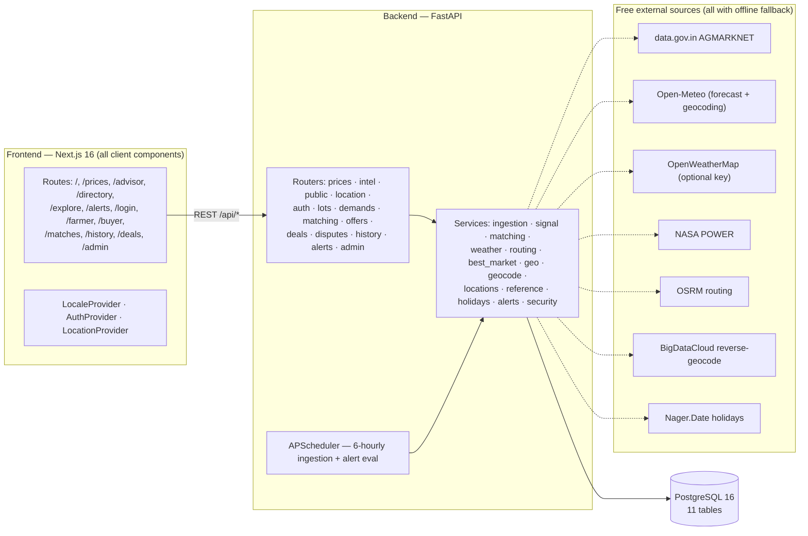
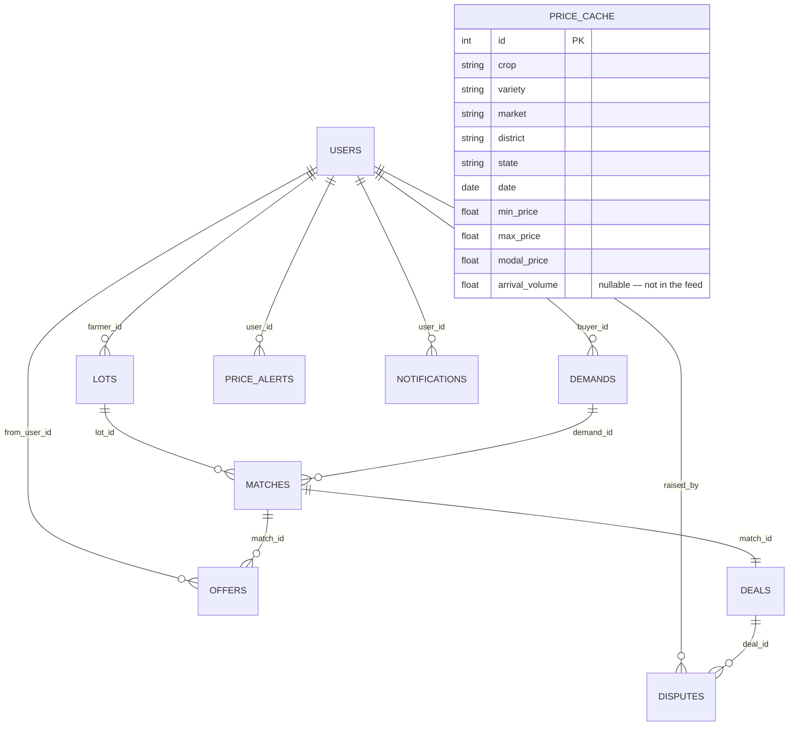
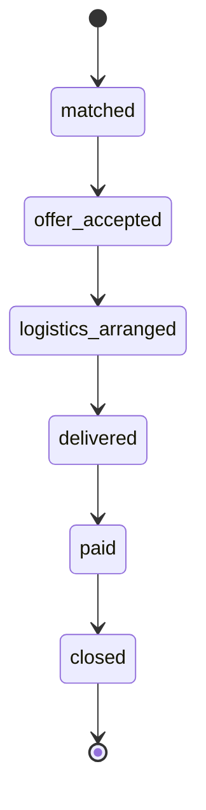

# AgriLink — SIH 2026 (PS 26132)

**A market-linkage and price-discovery platform for smallholder farmers and FPOs.**

AgriLink aggregates government mandi (wholesale market) prices and turns them into
decisions a farmer can act on: localised 7/30/90-day price trends, a
nearest-market comparison, and an **explainable** sell‑now‑vs‑wait
recommendation where every number that drove the call is shown on screen — in
**English, Hindi, or Marathi**. On top of prices it layers weather, Minimum
Support Price (MSP), crop-calendar timing, a transport-cost-adjusted "best
market", cold-storage / FPO discovery, price alerts, and a public
price-transparency dashboard. Phone-OTP accounts then connect farmers and buyers
through scored matches, an offer thread, a deal pipeline, and a dispute + admin
workflow.

Built **Maharashtra-first** (the SIH problem statement is Govt. of Maharashtra /
MSInS) but **location-aware across India** — detect or pick a location and prices
re-scope to that state; MSP and the storage/FPO directory are national.

**Status — Phases 1–3 complete, plus v1.1 and v1.2:**

| Phase | Scope | State |
|---|---|---|
| 1 · Price Discovery & i18n Shell | prices, trends, nearby markets, sell/wait signal, en/hi/mr | ✅ |
| 2 · Auth & Matching | phone-OTP auth, lots, demands, scored matches, offers | ✅ |
| 3 · Deal Tracking & Admin | deal pipeline, disputes, admin dashboard | ✅ |
| v1.1 · Intelligence layer | weather, MSP, calendar, best-market, storage/FPO, alerts, public overview | ✅ |
| v1.2 · Location awareness | geo/place picker, state-scoped prices, all-India directory, optional OpenWeather | ✅ |
| 4 · Cordova Android wrap | (planned — every route is already a client component) | ⏳ |

`.planning/` holds the full roadmap, research, and per-phase plans/summaries.

---

## Contents

- [What it does](#what-it-does)
- [Architecture](#architecture)
- [Tech stack](#tech-stack)
- [Repository layout](#repository-layout)
- [Prerequisites](#prerequisites)
- [Quickstart](#quickstart-local-offline-safe)
- [Configuration](#configuration)
- [Data sources](#data-sources)
- [API reference](#api-reference)
- [Database schema](#database-schema)
- [The sell / wait / hold signal](#the-sell--wait--hold-signal)
- [Match scoring](#match-scoring)
- [Deal pipeline](#deal-pipeline)
- [Authentication](#authentication)
- [Price ingestion pipeline](#price-ingestion-pipeline)
- [Location awareness (v1.2)](#location-awareness-v12)
- [Internationalisation](#internationalisation)
- [Testing](#testing)
- [Known limitations](#known-limitations)
- [More detail](#more-detail)

---

## What it does

### Public (no login)

| Route | What you get |
|---|---|
| `/` | Hero + crop/market picker, latest modal price, the sell/wait call as a gauge, and a statewide price snapshot. |
| `/prices` | 7/30/90-day trend as a gradient area chart; min / modal / max for the latest day; a horizontal bar comparison of the selected market against the nearest markets; and the transport-adjusted "best market" panel. |
| `/advisor` | The full sell / wait / hold reasoning: price momentum vs 7- and 30-day averages, weather pressure, MSP gap, crop-calendar phase (with glut-risk warning), and the next mandi holiday. |
| `/directory` | Cold storage / warehouses and FPOs near a district or state, with distance and capacity. |
| `/explore` | Statewide price transparency — top gainers/fallers (7-day), a 30-day average-price trend, all-crops table, and activity counters (markets reporting, crops tracked, open lots/demands, deals, disputes). Re-scopes to the chosen state. |
| `/alerts` | Create "notify me when crop X at market Y goes above/below ₹Z" alerts; an in-app notification bell polls unread count. (Managing alerts needs login.) |

A **location chip** in the header (browser geolocation · place search · all-India
state picker) sets the active location, persisted in `localStorage`.

### Accounts & trade (phone-OTP auth)

| Route | Role | What you do |
|---|---|---|
| `/login` | any | Enter phone + name + role → receive OTP (returned in the API response for the demo) → verify → get access + refresh tokens. |
| `/farmer` | farmer | List produce **lots** (crop, quantity, grade, expected price, availability date, location). Offline-safe: drafts autosave, submissions queue in `localStorage` and sync on reconnect. Shows nearby storage/FPOs. |
| `/buyer` | buyer | Post **demands** (crop, quantity, quality spec, price band, delivery window). |
| `/matches/[id]` | farmer/buyer | Scored lot×demand match with a component breakdown; an **offer thread** (propose price/quantity, counter, accept, decline). Accepting an offer creates a **deal**. |
| `/history` | farmer/buyer | Your lots, demands, and deals. |
| `/deals/[id]` | farmer/buyer/admin | Advance the deal through its pipeline; raise or view disputes. |
| `/admin` | admin | Dashboard: 30-day price trend, open-dispute queue, per-district price gaps, and price anomalies (>20% deviation from the 7-day average). |

---

## Architecture



- **Frontend** is a client-rendered SPA — every route is `"use client"`, calls
  the REST API directly, and uses no Next.js server actions or server-only
  features, so it can wrap unchanged in Apache Cordova later.
- **Backend** runs Alembic migrations on startup, seeds `price_cache` if empty,
  and starts a background scheduler that re-ingests prices every 6 hours and
  evaluates price alerts.
- **Every outbound call** (prices, weather, routing, geocoding, holidays) is
  wrapped — a failure returns a neutral/empty result, so the UI never blanks.

---

## Tech stack

| Layer | Choices |
|---|---|
| Backend | Python 3.13 · FastAPI 0.115 · SQLAlchemy 2.0 (typed `Mapped[]`) · Alembic 1.19 · APScheduler 3.11 · httpx 0.28 · python-jose (HS256 JWT) · Pydantic 2 / pydantic-settings |
| Database | PostgreSQL 16 (Docker), host port **5433** |
| Frontend | Next.js 16 (App Router, Turbopack) · React 19 · TypeScript · next-intl 4 · recharts · Tailwind CSS v4 |
| Tests | pytest 9 (SQLite in-memory) · Vitest 4 + Testing Library 16 |
| Fonts | Space Grotesk (headings) · DM Sans (body) · Noto Sans Devanagari (Hindi/Marathi) via `next/font/google` |

---

## Repository layout

```
agrilink/
├── docker-compose.yml          Postgres 16 → host :5433
├── README.md                   (this file)
├── backend/
│   ├── app/
│   │   ├── main.py             FastAPI app, lifespan (migrate + seed + scheduler), CORS, routers
│   │   ├── core/
│   │   │   ├── config.py       pydantic-settings (reads backend/.env)
│   │   │   ├── database.py     engine, SessionLocal, Base, get_db
│   │   │   └── security.py     OTP, JWT create/decode, get_current_user / CurrentUser
│   │   ├── models/             11 SQLAlchemy models (see Database schema)
│   │   ├── schemas/            Pydantic request/response models
│   │   ├── api/                one router per domain (prices, intel, public, location, auth,
│   │   │                       lots, demands, matching, offers, deals, disputes, history,
│   │   │                       alerts, admin)
│   │   └── services/
│   │       ├── ingestion.py    live → snapshot → fixture resolution + upsert
│   │       ├── snapshot.py / fixtures.py / data/    offline price sources
│   │       ├── signal.py       rule-based sell/wait/hold
│   │       ├── matching.py     lot×demand scoring engine
│   │       ├── weather.py      Open-Meteo forecast (+ optional OpenWeather) + NASA POWER anomaly
│   │       ├── routing.py      OSRM road distance (+ haversine fallback)
│   │       ├── best_market.py  net-price-after-transport ranking
│   │       ├── geo.py          district + all-India state centroids, haversine, nearest_state
│   │       ├── geocode.py      name → lat/lon and reverse-geocode (cached in geo_cache)
│   │       ├── locations.py    resolve_location, ensure_state_ingested (rate-limited)
│   │       ├── reference.py    MSP · crop calendar · cold-storage / FPO directory (curated)
│   │       ├── holidays.py     Nager.Date mandi holidays (+ fallback)
│   │       └── alerts.py       evaluate price alerts → notifications
│   ├── alembic/versions/       0001_initial · 94f518efb70d_auth_columns · 566ce44b97a1_v1_1
│   ├── tests/                  pytest suite (SQLite in-memory)
│   └── .env.example
├── frontend/
│   └── src/
│       ├── app/                App Router routes + layout.tsx + globals.css
│       ├── components/         PriceDetail, AdvisorDetail, SellWaitSignalCard,
│       │                       SignalGaugeChart, PriceTrendChart, MarketComparisonChart,
│       │                       NearbyResources, intel.tsx, NotificationBell, LocationChip,
│       │                       NavLinks, LanguageSwitcher, ui.tsx (design-system kit), …
│       ├── i18n/               LocaleProvider, config, messages/{en,hi,mr}.json, parity test
│       ├── lib/                api.ts (typed fetch layer), auth.ts, useCropMarket.ts,
│       │                       useLocation.tsx
│       └── test/               render helper
└── .planning/                  roadmap, research, phase plans & summaries
```

---

## Prerequisites

- **Docker** + **Docker Compose** (runs PostgreSQL 16)
- **Python 3.13** with the backend virtualenv at `backend/venv`
  (`pip install -r backend/requirements.txt`)
- **Node.js** + **npm** with `frontend/node_modules` installed (`cd frontend && npm install`)

> On Windows the venv Python is `backend/venv/Scripts/python.exe`. On macOS/Linux use
> `backend/venv/bin/python` and adjust the commands below accordingly.

---

## Quickstart (local, offline-safe)

Run in order. The app works with **no internet** — ingestion falls back to a
committed snapshot then synthetic fixtures, and every other external call
degrades to a neutral result.

1. **Database** — `docker compose up -d db`
   Postgres 16 on host port **5433** (a native PostgreSQL install commonly holds 5432).
2. **Migrations** (first run, or after pulling new migrations) —
   `cd backend && venv/Scripts/python.exe -m alembic upgrade head`
   The API also runs this automatically on startup (idempotent); running it by hand first
   makes failures obvious.
3. **Backend API** —
   `cd backend && venv/Scripts/python.exe -m uvicorn app.main:app --host 127.0.0.1 --port 8000`
   Interactive API docs at **http://localhost:8000/docs**.
4. **Frontend** —
   `cd frontend && node node_modules/next/dist/bin/next dev -p 3000`
   Use this, **not** `npm run dev` — the wrapper exits code 1 when backgrounded in a
   non-TTY shell on this setup. Interactively, `npm run dev` is fine.
5. Open **http://localhost:3000**.

To reset the database from scratch, see [backend/README.md](backend/README.md) → Migrations.

---

## Configuration

### `backend/.env` (copy from `backend/.env.example` — **gitignored, never commit**)

| Variable | Default | Notes |
|---|---|---|
| `DATABASE_URL` | `…@localhost:5433/agrilink` | Must point at **:5433** |
| `DATA_GOV_IN_API_KEY` | *(blank)* | Optional. Blank → ingestion uses the committed snapshot / fixtures |
| `INGEST_TRIGGER_SECRET` | *(blank)* | Blank → `POST /api/ingest/run` is disabled (403). Set a long random string, then send it as `X-Ingest-Secret` (constant-time compared) |
| `INGEST_STATES` | `Maharashtra` | States the scheduler ingests — comma-separated (`Maharashtra,Karnataka`) or `ALL` for the whole national feed |
| `JWT_SECRET_KEY` | *(blank)* | **Required for auth** — a long random string (`openssl rand -hex 32`). Blank → tokens fail to verify (local demo only) |
| `JWT_ALGORITHM` | `HS256` | |
| `ACCESS_TOKEN_EXPIRE_MINUTES` | `30` | |
| `REFRESH_TOKEN_EXPIRE_DAYS` | `7` | |
| `OTP_TTL_SECONDS` | `600` | OTP validity window |
| `EXPOSE_OTP` | `true` | Demo build returns the OTP in the `/auth/otp/request` response (the login page auto-fills it). Set `false` in production |
| `WEATHER_API_KEY` | *(blank)* | Optional OpenWeatherMap key — enriches the forecast with current conditions. Blank → keyless Open-Meteo only |
| `TRANSPORT_COST_PER_QTL_KM` | `0.4` | ₹/quintal/km used by `markets/best` |
| `REVERSE_GEOCODE_URL` | BigDataCloud | Free keyless reverse-geocoder |
| `ARRIVALS_SOURCE_URL` | *(blank)* | Leave blank — no live daily-arrivals source exists (tracked as PRICE-07) |
| `CORS_ORIGINS` | `http://localhost:3000` | Comma-separated allowed origins |

`GEE_*` variables may exist in `.env` (Google Earth Engine service account) but
are **not read** — satellite crop-health is deferred. `gee_service_account.json`
and `*service_account*.json` / `*credentials*.json` are gitignored.

### `frontend/.env` (optional)

| Variable | Default | Notes |
|---|---|---|
| `NEXT_PUBLIC_API_URL` | `http://localhost:8000` | Base URL of the backend API |

---

## Data sources

All free; all with an offline fallback so the app runs air-gapped.

| Source | Used for | Fallback |
|---|---|---|
| **data.gov.in AGMARKNET — current** (resource `9ef84268-…`) | today's mandi min/max/modal prices, whole national feed (`INGEST_STATES=ALL`, ~10k rows / 25 states) | committed `maharashtra_snapshot.csv` → synthetic fixtures (seed 26132) |
| **data.gov.in AGMARKNET — archive** (resource `35985678-…`, ~81M rows) | real per-series daily history for trend charts + the sell/wait signal, pulled lazily per viewed market+crop | synthetic random walk anchored to the real latest price, for days the archive doesn't cover |
| **Open-Meteo** `/v1/forecast` | 7-day precipitation / temp / wind / rain-probability | neutral "unavailable" result (signal weather factor → weight 0) |
| **Open-Meteo** geocoding | place name → lat/lon | local `MARKET_COORDS` + district/state centroid tables |
| **OpenWeatherMap** `/data/2.5/weather` *(needs `WEATHER_API_KEY`)* | current conditions overlay (temp, feels-like, humidity, description) | omitted; forecast still shown |
| **OSM Nominatim** `/reverse` | lat/lon → state + district (accurate, district-level) | BigDataCloud → `geo.nearest_place` (60-city table) → `nearest_state` |
| **NASA POWER** daily point | last-30-day rainfall vs 10-year normal | anomaly card hidden |
| **OSRM** `/route/v1/driving` | road distance + drive time for "best market" | straight-line haversine |
| **Nager.Date** `/PublicHolidays` | upcoming mandi holidays | built-in 2026 holiday list |
| **curated** (`app/services/reference.py`) | MSP (₹/quintal, official CACP 2024‑25 / 2025‑26), crop calendar (MH-tuned), cold-storage / FPO directory (MH in detail + national sample) | — (static) |

> data.gov.in also lists cold-storage / warehouse and MSP datasets, but they're
> state-level aggregates with no API and no geolocation (MSP is the same CACP
> numbers we already carry), and rainfall is better served by NASA POWER +
> Open-Meteo — so those stay curated / keyless.

---

## API reference

Base URL `http://localhost:8000`. All paths are prefixed `/api` unless noted.
**Auth** = requires `Authorization: Bearer <access_token>`.

### Prices (public)

| Method | Path | Query | Notes |
|---|---|---|---|
| GET | `/options` | `state?` | Distinct crop + market + district + state options. |
| GET | `/prices/trend` | `crop`, `market`, `days` (7/30/90) | Time series of min/modal/max (+ volume when present). |
| GET | `/prices/nearby` | `crop`, `district` | Latest modal price at the nearest markets, with distance. |
| GET | `/prices/signal` | `crop`, `market` | The sell/wait/hold recommendation + every reason. |
| POST | `/ingest/run` | header `X-Ingest-Secret` | Manual re-ingest. 403 unless `INGEST_TRIGGER_SECRET` is set and matches. |

### Intelligence — v1.1 (public)

| Method | Path | Query |
|---|---|---|
| GET | `/weather/forecast` | `market?` \| `district?` \| `lat?`+`lon?`, `include_anomaly?` |
| GET | `/msp` | `crop`, `market?` |
| GET | `/calendar` | `crop` |
| GET | `/storage/nearby` | `district?` \| `lat?`+`lon?`, `state?`, `max_km?`, `limit?` |
| GET | `/fpo/nearby` | `district?` \| `lat?`+`lon?`, `crop?`, `state?`, `limit?` |
| GET | `/markets/best` | `crop`, `market?` \| `district?` \| `lat?`+`lon?`, `fast?`, `limit?` |
| GET | `/holidays/upcoming` | `days?` (1–120) |

### Public dashboard

| Method | Path | Query |
|---|---|---|
| GET | `/public/overview` | `state?` — movers, 30-day trend, activity counters |

### Location — v1.2 (public)

| Method | Path | Query |
|---|---|---|
| GET | `/location/resolve` | `lat`+`lon` \| `place`, `ensure_prices?` — returns `{state, district, display_name, latitude, longitude, source, has_prices, ingest_attempt}` |
| GET | `/location/states` | — sorted list of all Indian states/UTs |

### Auth

| Method | Path | Body / notes |
|---|---|---|
| POST | `/auth/otp/request` | `{phone, name, role}` — creates/updates the user, returns the OTP in the response (demo) |
| POST | `/auth/otp/verify` | `{phone, code}` → `{access_token, refresh_token, token_type, user}` |
| POST | `/auth/refresh` | `{refresh_token}` → new token pair |
| GET | `/auth/me` | **Auth** — current user |

### Trade (all **Auth**)

| Method | Path | Notes |
|---|---|---|
| POST / GET | `/lots/` · `/lots/mine` · `/lots/{id}` | farmer lots; `create_lot` geocodes `location` → lat/lon and runs matching |
| POST / GET | `/demands/` · `/demands/mine` | buyer demands; posting runs matching |
| GET | `/matches/mine` · `/matches/{id}` | scored matches for the caller with `score_detail` |
| POST / GET | `/matches/{id}/offers` · | offer thread |
| POST | `/offers/{id}/accept` · `/offers/{id}/decline` | accept ⇒ creates a `Deal`, marks lot+demand `matched` |
| GET / PATCH | `/deals/mine` · `/deals/{id}` · `/deals/{id}/advance` | pipeline; access = lot farmer, demand buyer, or admin |
| POST / GET | `/deals/{id}/disputes` · | raise / list disputes (one open dispute per deal) |
| PATCH | `/disputes/{id}/close` | close a dispute |
| GET | `/history` | caller's lots + demands + deals |

### Alerts & notifications (all **Auth**)

| Method | Path |
|---|---|
| POST / GET | `/alerts` · |
| PATCH / DELETE | `/alerts/{id}/toggle` · `/alerts/{id}` |
| GET | `/notifications` · `/notifications/unread-count` |
| PATCH / POST | `/notifications/{id}/read` · `/notifications/read-all` |

### Admin (**Auth**, role `admin`)

| Method | Path |
|---|---|
| GET | `/admin/dashboard` — totals, 30-day price trend, dispute queue, district price gaps, price anomalies (>20% off 7-day avg) |

---

## Database schema

PostgreSQL, managed **only** by Alembic (no `create_all`). `Base` carries a
deterministic constraint-naming convention.



| Table | Key columns | Status/enum values |
|---|---|---|
| `price_cache` | `crop, variety, market, district, state, date, min/max/modal_price, arrival_volume?` — unique `(market, crop, variety, date)` | — |
| `users` | `role, name, phone` (unique), `district, taluka, kyc_status`, `otp_code?`, `otp_expires_at?`, `is_active`, `created_at` | role: `farmer` \| `buyer` \| `admin` |
| `lots` | `farmer_id→users`, `crop, quantity_kg, quality_grade, photo_url?, expected_price, available_from, location, latitude?, longitude?` | status: `open` \| `matched` \| `closed` |
| `demands` | `buyer_id→users`, `crop, quantity_kg, quality_spec, price_band_min/max, delivery_window` | status: `open` \| `matched` \| `closed` |
| `matches` | `lot_id→lots`, `demand_id→demands`, `score`, `score_detail` (JSON string) | status: `proposed` \| `offered` \| `accepted` \| `rejected` |
| `offers` | `match_id→matches`, `from_user_id→users`, `price, quantity, message?`, `created_at` | status: `pending` \| `countered` \| `accepted` \| `declined` |
| `deals` | `match_id→matches`, `agreed_price, agreed_quantity`, `logistics_mode`, `payment_status`, `pipeline_status`, `created_at` | pipeline: `matched → offer_accepted → logistics_arranged → delivered → paid → closed` |
| `disputes` | `deal_id→deals`, `raised_by→users`, `reason`, `created_at` | status: `open` \| `closed` |
| `geo_cache` | `query` (unique), `latitude, longitude, display_name, admin1/2/3`, `created_at` | reverse-geocode key = `@rev:{lat},{lon}` |
| `price_alerts` | `user_id→users`, `crop, market, direction, threshold, active, last_triggered_at?` | direction: `above` \| `below` |
| `notifications` | `user_id→users`, `kind, title, body, link?, read`, `created_at` | kind: `price_alert` \| `deal` \| `dispute` \| `digest` \| `system` |

Migrations: `0001_initial_schema` · `94f518efb70d_auth_columns` (OTP + `is_active` + `created_at`) · `566ce44b97a1_v1_1_weather_geo_alerts` (`geo_cache`, `price_alerts`, `notifications`, `lots.lat/lon`, `price_cache.state`).

---

## The sell / wait / hold signal

`app/services/signal.py` — **rule-based, not ML**. Needs ≥ 7 days of price
history for a single crop+market (else returns "not enough data"). Every number
in the decision is echoed back in `reasons[]`.

**Factors and weights**

| Factor | Weight | Logic |
|---|---|---|
| Price momentum | **×2** | `+1` if today's modal is ≥ 5% above the 30-day average **and** the 7-day average isn't lagging; `−1` if ≥ 5% below; `0` otherwise. With < 14 days of data it drops to a 7-day-trend note only. |
| Arrival-volume trend | ×1 | Needs 14 days of non-null volume. `+1` if this week's average arrivals are ≥ 15% above last week's (glut coming → sell); `−1` if ≥ 15% below (tightening → wait). **Usually skipped** — the feed has no volume (see limitations), and the reason says so. |
| Weather pressure | ×1 | `sell_bias` from `weather.get_forecast`: `+1` when ≥ 20 mm rain is expected in 3 days or ≥ 3 wet days in 5 (move produce now). `0` when the source is unavailable. |
| MSP overlay | *advisory, not scored* | If the modal price is below MSP, the reason flags that a government procurement centre may pay more. |

**Decision** — `total = 2·price + volume + weather`:
`total ≥ 2 → sell_now` · `total ≤ −2 → wait` · otherwise `hold`.

The frontend renders this as a half-doughnut gauge (`SignalGaugeChart`) plus the
full reason list on `/advisor`.

---

## Match scoring

`app/services/matching.py` — `score_pair(...)` is a **pure function** (plain
values, no ORM), so it is fully unit-tested. `run_matching(db)` runs
synchronously after every new lot or demand, scoring every open lot × open demand
pair that shares a crop (case-insensitive) and upserting `Match` rows for pairs
scoring **≥ 30**. Accepted/rejected matches are never overwritten.

| Component | Max | Formula |
|---|---|---|
| Quantity fit | 30 | `min(lot, demand) / max(lot, demand) × 30` |
| Price overlap | 40 | 40 if the lot's expected price is inside the demand's `[band_min, band_max]`; otherwise partial credit `max(0, 1 − gap/band_width) × 40`; 0 for a point band that doesn't match exactly |
| Distance | 30 | Lot's geocoded coords → buyer district centroid (haversine) when available, else district-centroid distance. Brackets: ≤ 50 km → 30, ≤ 150 → 20, ≤ 300 → 10, > 300 → 0. Unknown → neutral 15 |

`score_detail` is stored as JSON `{quantity, price, distance, total, max: 100}`
and shown as a breakdown on the match page.

---

## Deal pipeline

Accepting an offer (`POST /api/offers/{id}/accept`) creates a `Deal` from the
match, sets `agreed_price`/`agreed_quantity` from the offer, and flips the lot and
demand to `matched`. `PATCH /api/deals/{id}/advance` steps the deal one stage
forward:



Access to a deal is limited to the lot's farmer, the demand's buyer, or an admin.
Either party can raise **one** open dispute per deal; disputes are `open` until an
admin (or the raiser) closes them.

---

## Authentication

Phone-OTP only — no passwords (`app/core/security.py`).

```
POST /api/auth/otp/request  {phone, name, role}
     → upserts the user, generates a 6-digit OTP (secrets.randbelow),
       stores it with a 10-minute expiry, and returns it in the response
       (demo convenience — a real deployment would SMS it)

POST /api/auth/otp/verify   {phone, code}
     → constant-time compare; on success issues
       access_token  (HS256, 30 min)  +  refresh_token (7 days)

POST /api/auth/refresh      {refresh_token}  → new pair
```

The frontend stores tokens in `localStorage` (`lib/auth.ts`), attaches the bearer
header via `lib/api.ts`, and `AuthProvider` exposes `user` / `token` /
`isAuthenticated` to the tree. `kyc_status` is a stub flag, not real
verification.

---

## Price ingestion pipeline

`app/services/ingestion.py` → `resolve_ingestion_rows()` tries, in order:

1. **Live** — data.gov.in AGMARKNET, paginated, filtered to `INGEST_STATES` (or
   unfiltered when `ALL`). Requires `DATA_GOV_IN_API_KEY`. Called from startup
   seeding, the 6-hourly scheduler, and the rate-limited on-demand pull when a
   user selects a state with no cached prices (`locations.ensure_state_ingested`,
   ≤ 1 attempt/hour/state).
2. **Committed snapshot** — `app/services/data/maharashtra_snapshot.csv` (the
   resource's exact schema; authentic names/prices). Used ahead of fixtures only
   when a market+crop series has ≥ 7 dated points.
3. **Synthetic fixtures** — `app/services/fixtures.py`, deterministic (seed
   26132): 90 days across every market+crop, and the only source carrying
   `arrival_volume`. This is the normal offline demo path.

Rows are normalised and upserted on `(market, crop, variety, date)` (Postgres
`ON CONFLICT DO UPDATE`; a portable path for SQLite tests). After each run the
scheduler evaluates active `price_alerts` and writes `notifications` (20-hour
debounce per alert).

---

## Location awareness (v1.2)

- **Frontend** — `LocationProvider` / `useLocation` (in `lib/useLocation.tsx`)
  keeps `{state, district, label, lat, lon, source}` in
  `localStorage['agrilink.location']`. The header `LocationChip` offers browser
  geolocation, a place search, and an all-India state `<select>` (from
  `/api/location/states`).
- **Scoping** — `useCropMarket`, the home page, and `/explore` pass the chosen
  state to `/api/options` and `/api/public/overview`; `/directory` passes state +
  coordinates to `/api/storage/nearby` and `/api/fpo/nearby`.
- **Backend** — `/api/location/resolve` reverse-geocodes (BigDataCloud, cached in
  `geo_cache`; static `nearest_state` fallback) or forward-geocodes a place name,
  then optionally triggers `ensure_state_ingested` so that state's prices exist.
- **What stays Maharashtra** — the crop **calendar** only (region-specific
  agronomy). MSP is national; the storage/FPO **directory** carries a detailed
  Maharashtra set plus a national sample across the major producing states, each
  row tagged with `state` and coordinates. A state with no curated rows returns
  `[]` and the UI shows its normal empty state.

---

## Internationalisation

- **Client-only** — locale in `localStorage['agrilink.locale']`, no `/[locale]`
  routing, no next-intl middleware (keeps the app Cordova/static-export safe).
- `LocaleProvider` gates render behind a `ready` flag (shows `AppShellSkeleton`)
  so there's no flash of English on refresh. Header switcher: English / हिंदी / मराठी.
- `src/i18n/messages/en.json` is the **source of truth** for keys.
  `src/i18n/types.d.ts` types `useTranslations` against it (so a missing key is a
  TS error, and template-literal keys are rejected). `hi.json` / `mr.json` must
  cover every key — `src/i18n/messages/parity.test.ts` fails otherwise.

---

## Testing

```bash
cd backend && venv/Scripts/python.exe -m pytest -q          # SQLite in-memory, no container
cd backend && venv/Scripts/python.exe -m pytest -q -m "not pg"   # skip the Postgres-only upsert test
```

```bash
cd frontend && npm run test          # vitest run (one pass)
cd frontend && npm run test:watch    # watch mode
```

Backend coverage: the sell/wait signal cases and MSP/weather factors; geo
distance + `nearest_state`; ingestion normalise + live→snapshot→fixture fallback +
state override; the OpenWeather enrichment; location resolve + state-filtered
options/overview; the intelligence endpoints; auth + OTP; lots / demands /
matching / offers / deals / disputes / history; alerts; the admin dashboard.

Frontend: locale parity, `PriceDetail` (skeleton→data, error→Retry),
`SellWaitSignalCard` (each recommendation + reasons), `LanguageSwitcher`, and a
smoke test per authed page. Chart-rendering tests mock `recharts`.

Both suites run **offline**.

---

## Known limitations

- **No arrival volume (PRICE-07).** The OGD price resource has no daily
  arrivals/volume field and no other data.gov.in JSON resource exposes one. So
  `arrival_volume` is `null` on live and snapshot rows, and the signal's volume
  factor only contributes on fixture data — on real data it prints *"Arrival-volume
  data isn't available for this market, so this factor was skipped."* The
  `fetch_arrivals_rows()` seam is present but off unless `ARRIVALS_SOURCE_URL` is
  set.
- **KYC is a stub** — `kyc_status` is a flag, not real verification.
- **OTP is returned in the API response** for the demo — a real deployment would
  deliver it by SMS and never echo it.
- **Curated reference data** — MSP, the crop calendar, and the storage/FPO
  directory are curated samples with real geography, not live registries.
- **Crop calendar is Maharashtra-tuned** — sowing/harvest/peak windows outside
  Maharashtra will be approximate.
- **Satellite crop-health (GEE) is deferred** — credentials may sit in `.env`
  but nothing reads them.
- **Cordova wrap (Phase 4) not built** — the frontend is structured for it
  (all-client routes) but there's no `cordova/` project yet.

---

## More detail

- [backend/README.md](backend/README.md) — run, migrations & DB reset, tests, env vars, data sources, the arrivals limitation
- [frontend/README.md](frontend/README.md) — run, routes, tests, i18n model, config
- `.planning/` — roadmap, per-phase research, plans, and summaries
