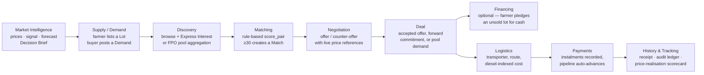
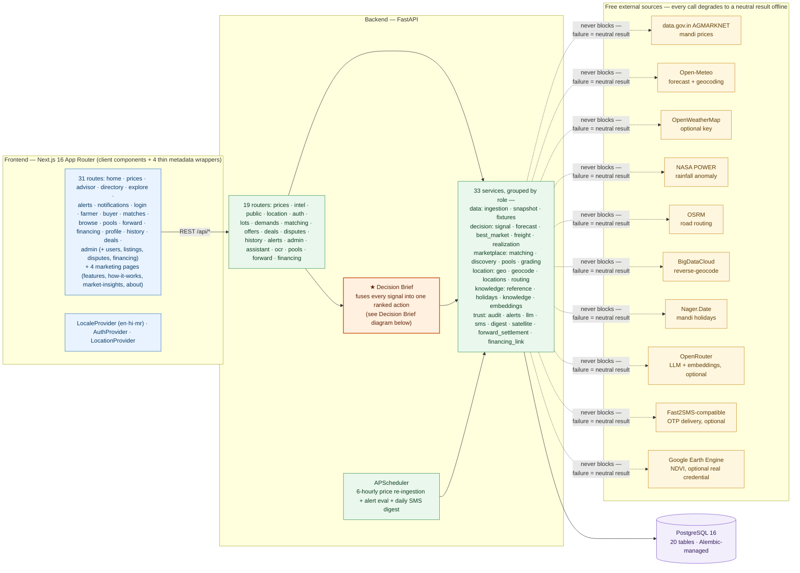
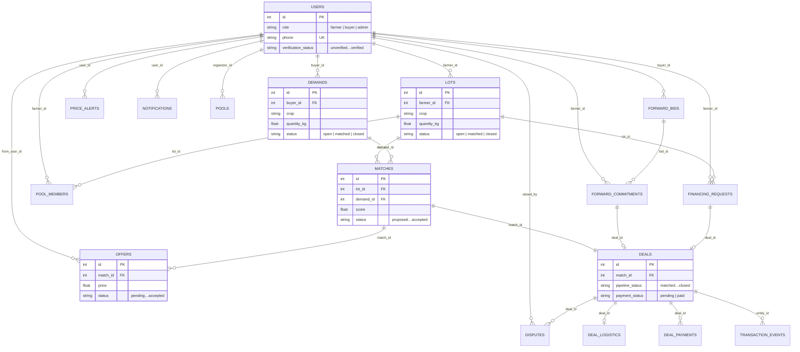
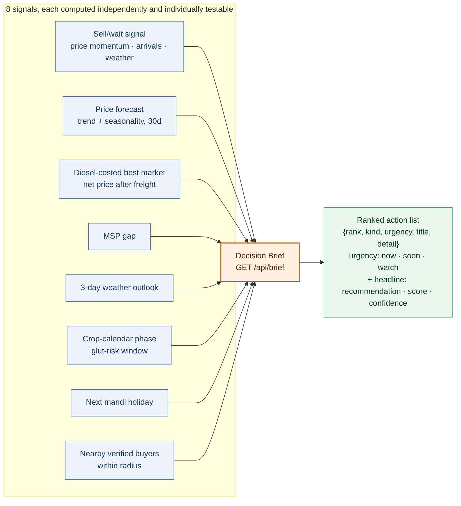
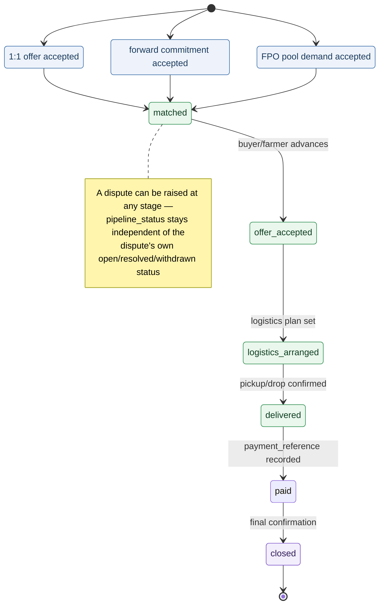

# AgriLink — SIH 2026 (PS 26132)

**A market-linkage and price-discovery platform for smallholder farmers and FPOs.**

AgriLink aggregates government mandi (wholesale market) prices and turns them into
decisions a farmer can act on: localised 7/30/90-day price trends, a
nearest-market comparison, and an **explainable** sell‑now‑vs‑wait
recommendation where every number that drove the call is shown on screen — in
**English, Hindi, or Marathi**. On top of prices it layers weather, Minimum
Support Price (MSP), crop-calendar timing, a **diesel-indexed** transport-cost
"best market", cold-storage / FPO discovery, price alerts, and a public
price-transparency dashboard. A single **Decision Brief** endpoint fuses all of
these into one ranked action plan. Phone-based accounts connect farmers and
buyers through scored matches, an offer thread with **price-referenced
counter-offers**, a deal pipeline, deal logistics + payments, an append-only
audit ledger, and a dispute + admin workflow. Farmers can pool produce for
collective bargaining through FPO-style groups, sell forward before harvest via
**forward contracts**, see their realised price vs the mandi and MSP after each
deal, browse nearby trade opportunities, photograph a mandi slip to auto-fill a
lot, and ask a grounded (retrieval-backed) assistant how MSP procurement, eNAM,
FPOs, or warehouse receipts work.

Built **Maharashtra-first** (the SIH problem statement is Govt. of Maharashtra /
MSInS) but **location-aware across India** — detect or pick a location and prices
re-scope to that state; MSP and the storage/FPO directory are national.

**Status — Phases 1–3 complete, plus v1.1 through v1.24 (last updated 2026-09-08):**

| Phase / Release | Scope | State |
|---|---|---|
| 1 · Price Discovery & i18n Shell | prices, trends, nearby markets, sell/wait signal, en/hi/mr | ✅ |
| 2 · Auth & Matching | phone login, lots, demands, scored matches, offers | ✅ |
| 3 · Deal Tracking & Admin | deal pipeline, disputes, admin dashboard | ✅ |
| v1.1 · Intelligence layer | weather, MSP, calendar, best-market, storage/FPO, alerts, public overview | ✅ |
| v1.2 · Location awareness | geo/place picker, state-scoped prices, all-India directory, optional OpenWeather | ✅ |
| v1.3 · LLM, OCR & FPO Pools | plain-language advisor, Ask AgriLink chat, mandi-slip OCR, pooled lots | ✅ |
| v1.4 · Identity, Discovery & Logistics | user profiles + verification, discovery board, deal logistics, price forecast, admin analytics | ✅ |
| v1.4 · Payments & audit ledger | deal instalment payments, transporter directory, append-only `transaction_events` timeline, structured quality grading | ✅ |
| v1.5 · Intelligence orchestration | diesel-indexed freight, **Decision Brief** (`/api/brief`), grounded knowledge retrieval (RAG) for Ask AgriLink | ✅ |
| v1.6 · Market linkage | price-realisation tracker, price-referenced counter-offers, **forward contracts** (pre-harvest) | ✅ |
| v1.7 · Dispute resolution | structured dispute close with `{outcome, resolution, evidence_url?}`, `resolved_by`/`resolved_at`, and a `withdrawn` status alongside `open`/`resolved` | ✅ |
| v1.8 · Forward settlement | overdue forward-commitment reminders, visibility only | ✅ |
| v1.9 · OCR polish, lot photos & Judges page | mandi-slip OCR hardening, `lots.photo_url`, the `/judges` evaluation hub, forgot-password OTP | ✅ |
| v1.10 · Semantic retrieval | optional embeddings-based re-ranking bonus for Ask AgriLink (degrades to keyword+fuzzy) | ✅ |
| v1.11 · Forward breach penalty | admin dispute-resolution can mark a forward commitment `breached` with a computed, non-collected penalty | ✅ |
| v1.12 · Satellite crop health | optional Google Earth Engine NDVI reading, folded into the Decision Brief | ✅ |
| v1.13 · Public realisation | anonymised, platform-wide price-realisation aggregate on `/explore` | ✅ |
| v1.14 · SMS digest | opt-in daily SMS summary of unread notifications | ✅ |
| v1.15 · Crop-calendar expansion | real curated sowing/harvest timing for ~10 crops across 8 states beyond Maharashtra | ✅ |
| v1.16 · Forecast second opinion | Holt's linear exponential-smoothing cross-check alongside the primary trend forecast | ✅ |
| v1.17 · Warehouse-receipt financing | farmer financing requests against a stored lot, admin review queue | ✅ |
| v1.18 · Buyer-perspective Decision Brief | `/api/brief?perspective=buyer` mirrors the same computation for a buyer's sourcing decision | ✅ |
| v1.19 · Navigation & IA overhaul | role-gated Advisor link, admin home + overview/activity tabs, dedicated `/admin/financing` and `/notifications` pages, terminology sync | ✅ |
| v1.20 · Full-lifecycle notifications | offer accept/decline, financing approve/reject, deal-pipeline advance, and dispute resolution now each create a real notification, not just price alerts and forward settlement | ✅ |
| v1.21 · Financing ↔ deal traceability | `financing_requests.deal_id` is stamped once the pledged lot actually sells (via a 1:1 offer accept or a pool acceptance), with a "View deal" link on both the farmer and admin financing screens | ✅ |
| v1.22 · History filters, match risk & trust signals | status-filter pills on `/history` (lots/demands/deals); a stale/at-risk banner on `/matches` when a proposed or offered match sits unanswered for 3+/7+ days; counterparty completed-deals count and member-since date shown alongside the verified badge | ✅ |
| v1.23 · Pool/forward-commitment race guards | DB-level unique constraints on `pool_members` and `forward_commitments` close a double-submit race (multi-tab, retried request) that could otherwise create two active rows for one farmer — closing the same class of bug fixed for offers/financing/disputes/deals earlier, at the insert layer instead of the status-transition layer | ✅ |
| v1.24 · Financing-request race guard | The same insert-layer race existed in `create_request` (warehouse-receipt financing) — a double-submit could pledge the same lot as collateral twice; closed with a partial unique index on `financing_requests.lot_id` | ✅ |
| 4 · Cordova Android wrap | (planned — nearly every route is already a client component; no server actions or server-only data fetching anywhere) | ⏳ |

`.planning/` holds the full roadmap, research, and per-phase plans/summaries.

---

## 1. What is AgriLink?

AgriLink is a market-linkage and price-discovery platform that turns government
mandi (wholesale market) data into decisions a smallholder farmer, buyer, or
FPO can act on, and then carries them the rest of the way to a paid, tracked
deal. It is not a price ticker and not a listing board in isolation — it is
the two joined into one pipeline, with an explainable recommendation engine
sitting in between: check today's price → get a reasoned sell-or-wait call →
find a verified counterparty → negotiate with real reference numbers → close a
deal whose logistics, payments, and disputes are all tracked on one append-only
ledger. Built for the Smart India Hackathon 2026, Problem Statement PS-26132
(Government of Maharashtra / MSInS).

## 2. Problem

Indian smallholder farmers routinely sell below a price they could have
gotten, not because a better price doesn't exist, but because the information
that would prove it isn't in a usable form:

- **Government price data exists but isn't actionable.** AGMARKNET publishes
  mandi prices, but a raw table of numbers doesn't tell a farmer whether today
  is a good day to sell, which nearby market nets more after transport, or
  whether a government MSP floor applies.
- **No transport-adjusted comparison.** A "better" price two mandis away can
  be worse once diesel cost is subtracted — nothing accessible does that
  subtraction for a farmer before they travel.
- **No direct, verified line to a buyer.** Farmers fall back on intermediaries
  who capture a disproportionate share of the margin, because there is no
  trusted way to find and transact with a buyer directly.
- **No record of whether a deal was actually fair.** Even when a sale happens,
  there is usually no way to check the realised price against the mandi
  average or MSP after the fact — so a farmer can't tell if a buyer, a broker,
  or the platform itself is serving them well over time.
- **Working capital is locked in unsold produce.** A farmer holding out for a
  better price has no way to raise cash against that stored produce in the
  meantime, forcing a sale before they're ready.

## 3. Solution

AgriLink addresses each of those gaps with a real, working feature — not a
future promise:

| Gap | AgriLink's answer |
|---|---|
| Raw prices aren't actionable | The **sell / wait / hold signal** (rule-based, every factor and weight shown) and the **Decision Brief** that fuses it with forecast, weather, MSP, and crop-calendar timing into one ranked action list |
| No transport-adjusted comparison | **Diesel-indexed best-market ranking** — net price after a real, inspectable freight calculation, not just the highest sticker price |
| No verified direct buyer link | Phone-accounts, an admin **verification** workflow, scored **lot×demand matching**, a **discovery board**, and an **offer/counter-offer** thread with live price references |
| No record of a fair deal | The **price-realisation tracker** — every closed deal's ₹/qtl compared against the AGMARKNET mandi average and MSP, farmer-facing and as a public, anonymised platform-wide aggregate |
| Working capital locked in produce | **Warehouse-receipt financing** — a farmer requests a cash advance against an unsold lot; an admin reviews it (see [Known limitations](#known-limitations) for what this does *not* do yet) |
| Fragmented, untracked transactions | One **deal pipeline** (matched → paid → closed) regardless of whether the deal came from a 1:1 offer, an FPO pool, or a pre-harvest forward contract, with logistics, instalment payments, and an **append-only audit ledger** shared across all three |

## 4. User Roles

| Role | Primary goal | What they can actually do |
|---|---|---|
| **Farmer** | Sell produce for a fair, provable price | Check prices and the sell/wait call for their crop; list **lots** (with OCR-assisted slip scanning and an offline queue); browse buyer demand and express interest; negotiate offers with live price references; pool produce with other farmers via **FPO pools**; commit to a buyer's **forward contract** pre-harvest; request **financing** against a stored lot; manage delivery logistics and instalment payments on a deal; see their own **price-realisation scorecard**; raise a dispute |
| **Buyer / Trader** | Source verified, quality-matched supply reliably | Everything symmetric to a farmer on the demand side: check prices (with a buyer-perspective **Decision Brief** — buy-now/wait-to-buy, cheapest market, nearby sellers); post **demands**; browse open lots; negotiate; post a pre-harvest **forward bid**; manage logistics/payments on a deal; raise a dispute |
| **Admin** | Keep the marketplace trustworthy and healthy | Review and approve/reject user **verification** requests; moderate open lots/demands; resolve **disputes** (with an optional forward-contract breach penalty); review the **financing** queue; monitor the platform via a KPI dashboard, GMV/funnel/deal-success analytics, and an exportable append-only activity ledger. Admins have no lot/demand of their own — the Home page reflects that with a KPI-and-quick-links view instead of the farmer/buyer price dashboard |

Every role signs in through the same `/login`; the app then branches
navigation, the Home page, and every page's own access guard by
`user.role` — see [Role-Based Architecture](#8-role-based-architecture).

## 5. Current Feature Architecture

Grouped by what actually ships today (see [What it does](#what-it-does) for
the full per-route breakdown, and [Known limitations](#known-limitations) for
what's explicitly *not* built):

- **Market intelligence** — live mandi prices, 7/30/90-day trends with a
  statistical forecast (+ a second-opinion cross-check), the sell/wait/hold
  signal, MSP gap, weather (7-day forecast + 30-day rainfall anomaly), crop
  calendar, mandi holidays, diesel-indexed best-market ranking, optional
  satellite (NDVI) crop-health, and the **Decision Brief** that fuses all of
  it — seller and buyer perspectives — into one ranked action list.
- **Supply & demand** — farmer lots and buyer demands, with OCR-assisted lot
  creation and an offline-safe submission queue.
- **Discovery & matching** — a rule-based, fully transparent scoring engine
  (quantity fit + price overlap + distance) that runs automatically on every
  new lot/demand, plus a manual discovery board with "Express interest".
  FPO-style **pools** aggregate several farmers' produce into one scored
  virtual lot.
- **Negotiation** — an offer/counter-offer thread with a **negotiation
  context** endpoint that surfaces the current spread, a suggested midpoint,
  and mandi/MSP/asking-band references, so neither side has to counter blind.
- **Deal lifecycle** — one pipeline (`matched → offer_accepted →
  logistics_arranged → delivered → paid → closed`) regardless of origin (1:1
  offer, FPO pool, or forward contract), with a logistics plan, instalment
  payments, an append-only audit timeline, and a printable receipt.
- **Forward contracts** — pre-harvest buyer bids and farmer commitments, with
  a crop-calendar sanity check and a computed (non-collected) breach penalty
  on dispute resolution.
- **Financing** — warehouse-receipt-backed cash-advance requests against a
  stored lot, capped at 75% loan-to-value, admin-reviewed.
- **Trust & accountability** — admin-manual verification, a structured
  dispute-resolution workflow, and the price-realisation tracker (farmer-facing
  and as a public anonymised aggregate).
- **Assistance** — an optional LLM readability layer (plain-language advisor
  summary, "Ask AgriLink" grounded Q&A, OCR) that only ever rephrases numbers
  the rule-based engine already computed — never a source of truth.
- **Notifications** — an in-app feed covering a price-alert crossing, an
  overdue forward-contract settlement, an offer accept/decline, a financing
  approve/reject, a deal-pipeline advance, and a dispute resolution.
- **Admin operations** — a tabbed dashboard (overview / analytics / activity),
  user verification and moderation queues, dispute resolution, and financing
  review, each promoted to its own dedicated page (v1.19).

## 6. Platform Workflow

The end-to-end lifecycle, as actually implemented (not every deal takes every
branch — a forward contract or an FPO pool skips straight to "Matched"):



A dispute can be raised at any point after a deal exists, independent of
which pipeline stage it's at, and its resolution is itself written to the same
append-only ledger every other step uses.

## 7. Technical Architecture

Frontend: Next.js 16 (App Router) client-rendered SPA, 31 routes. Backend:
FastAPI, 19 routers, 111 endpoints, 32 single-responsibility services.
Database: PostgreSQL 16, 20 tables, 21 linear Alembic migrations. 11 free
external data sources, every one with an offline-safe fallback. Full diagrams,
the complete API reference, and the database ER diagram are in
[Architecture](#architecture), [API reference](#api-reference), and
[Database schema](#database-schema) below — this section exists so the
narrative above doesn't have to repeat them.

## 8. Role-Based Architecture

The same codebase renders a genuinely different experience per role, gated in
one place (`user.role` from `AuthProvider`) and enforced again server-side on
every request:

- **Navigation** — a farmer sees My Lots, a buyer sees My Demands; both see
  Advisor, Marketplace, Pools/Forward, History, Alerts; only a farmer sees
  Financing; only an admin sees the Administration section (Dashboard, Users,
  Listings, Disputes, Financing) and none of the Trade section, because an
  admin has no lot or demand of their own to act on.
- **Home page** — a logged-out visitor gets the marketing Landing page; a
  farmer/buyer gets the price dashboard + Decision Brief hero; an admin gets
  `AdminHome` — KPI tiles (open disputes, pending financing, open lots, total
  deals) and quick links, because a price snapshot has nothing for an admin to
  do with it.
- **Data scope** — every list/detail endpoint filters by the caller's own
  role and ownership (a farmer only ever sees their own lots and the deals
  their lots are part of; a buyer only their own demands; an admin sees
  everything but creates nothing transactional).
- **Server-side enforcement** — every role distinction shown in the UI is
  re-checked by a `require_role(...)` dependency or an explicit ownership
  check in the API layer, not just hidden navigation — see the **Auth**
  column in [API reference](#api-reference).

## 9. Unique Differentiators

- **One ranked Decision Brief, not eight separate widgets.** The Decision
  Brief is the single biggest thing that separates AgriLink from a
  price-lookup app — it fuses the sell/wait signal, forecast, diesel-costed
  best market, MSP gap, weather, crop calendar, mandi holidays, and nearby
  verified counterparties into one prioritised action list, for both a
  seller's and (v1.18) a buyer's decision.
- **Honestly explainable, not a black box.** The signal and forecast are
  disclosed rule-based/statistical methods with every factor and weight shown
  — not framed as AI, because they aren't; the two genuinely AI-powered
  features (OCR, the LLM readability layer) are also named as such.
- **A real diesel-indexed transport cost**, not a flat per-km guess — so
  "best market" reflects what a farmer would actually net, not just the
  highest sticker price.
- **Every deal, whatever its origin, lands in one pipeline.** A 1:1 offer, an
  FPO pool acceptance, and an accepted forward contract all materialise into
  the exact same `Deal` row, so logistics, payments, disputes, and the audit
  ledger work identically no matter how the deal was struck.
- **Price-realisation tracking closes the loop.** Nearly every market-linkage
  concept ends at "deal struck" — AgriLink measures afterward whether that
  deal actually beat the open mandi and MSP, per farmer and as a public,
  anonymised, platform-wide aggregate.
- **Forward contracts with a real crop-calendar check and a computed breach
  penalty** — pre-harvest commitments aren't just a form; they're checked
  against real regional sowing/harvest timing and have a resolvable
  consequence if broken.
- **Offline-safe by construction**, not as an afterthought — every external
  call (prices, weather, routing, geocoding, holidays, LLM) degrades to a
  neutral result, and lot creation queues in `localStorage` and syncs when
  connectivity returns.
- **Trilingual at 100% parity**, enforced by an automated test, not just
  translated once and left to drift.

## 10. Future Scope

**Implemented today** — see [Current Feature Architecture](#5-current-feature-architecture)
above and the Status table for the complete, version-by-version list; nothing
in this README describes a feature that isn't in the running code.

**Planned / not yet built:**

- **Cordova Android wrap** (Phase 4) — not started, but the frontend is
  deliberately architected for it (client components only, no server actions
  or server-only data fetching on 30 of 31 routes).
- **Real financing disbursement** — the `/financing` flow tracks a request and
  an admin decision only; actually advancing funds needs a licensed bank/NBFC
  or warehouse partner integration, which doesn't exist.
- **Automated e-KYC** — verification is admin-manual today; a PM-Kisan API or
  Aadhaar UIDAI integration would remove that manual step.
- **A live daily-arrivals data source** (tracked as PRICE-07) — no
  data.gov.in resource currently exposes one, so the signal's volume factor
  only ever contributes on offline fixture data.
- **Production-scale load testing and a security-response-header /
  dynamic-scanner (OWASP ZAP) pass** — a local benchmark and two static/
  dependency scanners (bandit, pip-audit) have been run; neither is a
  substitute for a production-scale test.

---

## Contents

**Product story**
- [1. What is AgriLink?](#1-what-is-agrilink)
- [2. Problem](#2-problem)
- [3. Solution](#3-solution)
- [4. User Roles](#4-user-roles)
- [5. Current Feature Architecture](#5-current-feature-architecture)
- [6. Platform Workflow](#6-platform-workflow)
- [7. Technical Architecture](#7-technical-architecture)
- [8. Role-Based Architecture](#8-role-based-architecture)
- [9. Unique Differentiators](#9-unique-differentiators)
- [10. Future Scope](#10-future-scope)

**Reference**
- [What it does](#what-it-does)
- [Architecture](#architecture)
- [Tech stack](#tech-stack)
- [Repository layout](#repository-layout)
- [Prerequisites](#prerequisites)
- [Quickstart](#quickstart-local-offline-safe)
- [Configuration](#configuration)
- [Data sources](#data-sources)
- [API reference](#api-reference)
- [Database schema](#database-schema)
- [The sell / wait / hold signal](#the-sell--wait--hold-signal)
- [Decision Brief](#decision-brief)
- [Satellite crop health](#satellite-crop-health)
- [Diesel-indexed freight](#diesel-indexed-freight)
- [Price forecast](#price-forecast)
- [Match scoring](#match-scoring)
- [Counter-offer decision context](#counter-offer-decision-context)
- [Deal pipeline](#deal-pipeline)
- [Deal logistics](#deal-logistics)
- [Payments & audit ledger](#payments--audit-ledger)
- [Price-realisation tracker](#price-realisation-tracker)
- [Forward contracts](#forward-contracts)
- [Warehouse-receipt financing](#warehouse-receipt-financing)
- [FPO pools (collective bargaining)](#fpo-pools-collective-bargaining)
- [Discovery board](#discovery-board)
- [User profiles & verification](#user-profiles--verification)
- [LLM readability layer](#llm-readability-layer)
- [Grounded knowledge retrieval (RAG)](#grounded-knowledge-retrieval-rag)
- [OCR lot-slip assist](#ocr-lot-slip-assist)
- [Authentication](#authentication)
- [Price ingestion pipeline](#price-ingestion-pipeline)
- [Location awareness (v1.2)](#location-awareness-v12)
- [Internationalisation](#internationalisation)
- [Testing](#testing)
- [Known limitations](#known-limitations)
- [More detail](#more-detail)

---

## What it does

### Public (no login)

| Route | What you get |
|---|---|
| `/` | Hero + crop/market picker, latest modal price, the sell/wait call as a gauge, and a statewide price snapshot. |
| `/prices` | 7/30/90-day trend as a gradient area chart with a **dashed 30-day forecast line and prediction band**; min / modal / max for the latest day; a horizontal bar comparison of the selected market against the nearest markets; and the transport-adjusted "best market" panel. |
| `/advisor` | A **Decision Brief** at the top — one ranked action plan (`now` / `soon` / `watch`) fusing the sell/wait signal, forecast, diesel-costed best market, MSP gap, weather, crop calendar, mandi holidays and nearby verified buyers — followed by the full sell / wait / hold reasoning: price momentum vs 7- and 30-day averages, weather pressure, MSP gap, crop-calendar phase (with glut-risk warning), and the next mandi holiday. An optional **"In plain words"** panel (LLM) restates the ruling in 2-3 farmer-friendly sentences in the chosen language. **v1.18** — a signed-in buyer sees the same computation mirrored for a sourcing decision (`buy_now`/`wait_to_buy`/`hold`, cheapest-market ranking, nearby sellers instead of buyers). Sidebar navigation surfaces this link for farmer/buyer accounts only; admins use the Admin Dashboard instead. |
| **Ask AgriLink** | A floating assistant (LLM, optional) that answers from the selected crop/market's live data **and** from a curated, retrieval-backed knowledge base — MSP procurement, APMC/eNAM, FPOs, grading, warehouse receipts, PMFBY/PM-KISAN, how the signal and freight are computed. Shows its source chips; says "I don't have that" when nothing matches. Without an LLM key it still returns the grounded reference text. |
| `/directory` | Cold storage / warehouses and FPOs near a district or state, with distance and capacity. |
| `/explore` | Statewide price transparency — top gainers/fallers (7-day), a 30-day average-price trend, all-crops table, and activity counters (markets reporting, crops tracked, open lots/demands, deals, disputes). Re-scopes to the chosen state. |
| `/alerts` | Create "notify me when crop X at market Y goes above/below ₹Z" alerts; an in-app notification bell polls unread count. (Managing alerts needs login.) |

A **location chip** in the header (browser geolocation · place search · all-India
state picker) sets the active location, persisted in `localStorage`.

### Marketing site (no login)

A public-facing site around the product, served by `PublicHeader` (transparent
over the home hero, solid frosted-glass elsewhere) and a shared `Landing`
component with a fixed, translucent parallax backdrop.

| Route | What it shows |
|---|---|
| `/` | Landing page — hero, live activity stats, a feature preview grid, a 3-step "how it works" summary, and cross-links into the pages below. |
| `/features` | Bento-grid deep dive into every capability (live prices, explainable sell/wait signal, best-market routing, verified buyer linkage, deal tracking), then alternating sections on market intelligence, the decision engine, logistics, and pools/forward contracts. |
| `/how-it-works` | Role-tabbed walkthrough (Farmer / Buyer / FPO) — a step timeline per role, plus a trust-signals panel (verification, open data sources, the append-only ledger, offline-safety). |
| `/market-insights` | Showcases the data-intelligence layer — live activity counters, six analytics capabilities, the open-data-source list, and a preview card linking to `/explore`. |
| `/about` | Mission/vision, live impact numbers, core values, the SIH problem-statement context, and a technology-highlights grid. |

These four are trilingual (en/hi/mr) like the rest of the app, and each ships as
a thin Server Component `page.tsx` (for a per-page `<title>`/description) that
renders a `"use client"` `*PageClient.tsx` — the only routes in the app that
aren't a client component top-to-bottom; see [Architecture](#architecture).

### Accounts & trade (phone login)

| Route | Role | What you do |
|---|---|---|
| `/login` | any | Two tabs on one screen: **Sign in** (phone + password) or **Create account** (phone + name + role + district + state + password). Returns access + refresh tokens. Passwords are PBKDF2-hashed; no OTP / SMS. |
| `/farmer` | farmer | List produce **lots** (crop, quantity, grade, expected price, availability date, location). **OCR assist** — photograph a mandi slip and the fields auto-fill from the image. Offline-safe: drafts autosave, submissions queue in `localStorage` and sync on reconnect. Shows nearby storage/FPOs. |
| `/buyer` | buyer | Post **demands** (crop, quantity, quality spec, price band, delivery window, delivery district). |
| `/matches/[id]` | farmer/buyer | Scored lot×demand match with a component breakdown; an **offer thread** (propose price/quantity, counter, accept, decline). A **"Counter"** action pre-fills the form from the other side's offer, alongside a price-references strip — mandi modal, MSP, asking band, current spread, and a one-tap "use midpoint". Accepting an offer creates a **deal**. **v1.22** — a trust-signal line (counterparty's completed-deal count and member-since date) sits below the verified badge. |
| `/forward` | farmer/buyer | **Forward contracts.** A buyer posts a pre-harvest bid (crop, quantity, price band, future delivery window); a farmer growing that crop commits part of the not-yet-harvested lot at a locked price. A crop-calendar check warns when the ready date misses the crop's harvest months. On acceptance the commitment materialises straight into the deal pipeline. |
| `/browse` | farmer/buyer | **Discovery board** — buyers browse open lots nearby; farmers browse open demands nearby. Radius filter (nearby / all-India), crop filter, verified-seller badge, and a one-tap "Express interest" that opens a match or explains why no match yet. |
| `/pools` | farmer | **FPO-style pooled lots** — create or join a collective for one crop. The pool aggregates committed members into a single virtual lot (quantity-weighted price, floored at the organizer's floor price) and scores it against open buyer demands, showing ranked candidates. |
| `/pools/[id]` | farmer | Pool detail: aggregate stats (fill %, effective price), member list, and — for the organizer — the ranked demand candidates to negotiate with. |
| `/financing` | farmer | **Warehouse-receipt financing (v1.17)** — pledge an open, unsold lot as collateral and request a cash advance (capped at 75% of the lot's estimated value); track pending/approved/rejected requests and withdraw a pending one. No real money moves — an admin approves/rejects, same as account verification. |
| `/profile` | any | **User profile & verification** — set trading location (GPS, header chip, or manual entry) so distance-aware matching and radius filters work accurately. Request admin verification (unverified → pending → verified), optionally citing a PM-Kisan ID / Aadhaar reference. |
| `/history` | farmer/buyer | Your lots, demands, and deals ("Deals & History" in navigation). Farmers also get a **price-realisation scorecard** — realised ₹/qtl vs the AGMARKNET mandi average and MSP for every completed deal, with a volume-weighted uplift headline and a per-deal bar chart. **v1.22** — status-filter pills on each of the three lists. |
| `/deals/[id]` | farmer/buyer/admin | Advance the deal through its pipeline; view and update the **logistics plan** (mode, transporter from the directory, vehicle, pickup/drop points, diesel-indexed cost estimate); record **instalment payments**; see the append-only **transaction timeline**; open a printable **receipt**; raise or view disputes. |
| `/notifications` | any | **v1.19** — full notification history (the header bell only ever showed a handful): All/Unread tabs, mark-all-read, click-to-open-and-mark-read. |
| `/` (admin) | admin | **v1.19** — admins land on a dedicated `AdminHome` greeting + KPI tiles (open disputes, pending financing, open lots, total deals) and quick links, instead of the farmer/buyer one-crop price snapshot that has nothing for them to act on. |
| `/admin` | admin | **Overview tab**: 30-day price trend, per-district (per-crop) price gaps, price anomalies (>20% deviation from 7-day avg), and summary cards linking out to the disputes and financing queues. **Analytics tab**: GMV, marketplace funnel, deal-pipeline breakdown, deal-success rate, payment-status split, avg hours to deal, price-realisation vs MSP per crop, supply vs demand, user activity. **Activity tab**: the append-only `transaction_events` feed (viewable + CSV export). Navigation label reads "Dashboard". |
| `/admin/users` | admin | List, search, filter by role/verification status, approve/reject verification requests, activate/deactivate accounts. |
| `/admin/listings` | admin | Moderate open lots/demands — force-close a listing. |
| `/admin/disputes` | admin | Dispute resolution queue — set `{outcome, resolution, evidence_url?}`, optionally apply the forward-contract breach penalty. |
| `/admin/financing` | admin | **v1.19**, promoted from an embedded panel to its own page — full review history (not just the pending queue) for warehouse-receipt financing requests, approve/reject with a note. |

---

## Architecture



- **Frontend** is a client-rendered SPA — nearly every route is `"use client"`
  top-to-bottom, calls the REST API directly, and uses no Next.js server actions
  or server-only data fetching, so it can wrap unchanged in Apache Cordova later.
  The four marketing pages (`/features`, `/how-it-works`, `/market-insights`,
  `/about`) are the one exception: a thin Server Component `page.tsx` supplies a
  per-page `<title>`/description, then renders a `"use client"` component that
  does the actual work — still no server actions or dynamic server data, so the
  static-export path is unaffected.
- **Backend** runs Alembic migrations on startup, seeds `price_cache` if empty,
  and starts a background scheduler that re-ingests prices every 6 hours and
  evaluates price alerts.
- **Every outbound call** (prices, weather, routing, geocoding, holidays, LLM)
  is wrapped — a failure returns a neutral/empty result, so the UI never blanks.

---

## Tech stack

| Layer | Choices |
|---|---|
| Backend | Python 3.13 · FastAPI 0.115 · SQLAlchemy 2.0 (typed `Mapped[]`) · Alembic 1.19 · APScheduler 3.11 · httpx 0.28 · python-jose (HS256 JWT) · Pydantic 2 / pydantic-settings · python-multipart (file upload for OCR) |
| Database | PostgreSQL 16 (Docker), host port **5433** |
| Frontend | Next.js 16.3 (App Router, Turbopack) · React 19 · TypeScript · next-intl 4 · recharts 3 · Tailwind CSS v4 |
| Tests | pytest 9 (SQLite in-memory) · Vitest 4 + Testing Library 16 |
| LLM | OpenRouter API (optional) — any vision-capable model; used for plain-language advisor, Ask AgriLink, OCR slip-reading, live-string translation |
| Fonts | Poppins (headings + body) · Noto Sans Devanagari (Hindi/Marathi) via `next/font/google` |

---

## Repository layout

```
agrilink/
├── docker-compose.yml          local dev: Postgres 16 → host :5433
├── docker-compose.prod.yml     production stack: db + backend + frontend + Caddy
├── Caddyfile                   reverse proxy — one origin, /api → backend, else → frontend
├── README.md                   (this file)
├── DEPLOYMENT.md               single-VM deploy guide
├── backend/Dockerfile · frontend/Dockerfile   (+ .dockerignore each)
├── backend/
│   ├── app/
│   │   ├── main.py             FastAPI app, lifespan (migrate + seed + scheduler), CORS, routers
│   │   ├── core/
│   │   │   ├── config.py       pydantic-settings (reads backend/.env)
│   │   │   ├── database.py     engine, SessionLocal, Base, get_db
│   │   │   └── security.py     JWT create/decode, get_current_user / CurrentUser
│   │   ├── models/             18 files defining 20 SQLAlchemy tables (see Database schema)
│   │   ├── schemas/            Pydantic request/response models
│   │   ├── api/                one router per domain (prices, intel, public, location, auth,
│   │   │                       lots, demands, matching, offers, deals, disputes, history,
│   │   │                       alerts, admin, assistant, ocr, pools, forward, financing)
│   │   └── services/
│   │       ├── ingestion.py    live → snapshot → fixture resolution + upsert
│   │       ├── snapshot.py / fixtures.py / data/    offline price sources
│   │       ├── signal.py       rule-based sell/wait/hold
│   │       ├── forecast.py     interpretable trend+weekly-seasonality price forecast (no ML)
│   │       ├── brief.py        Decision Brief — one ranked action plan from every signal
│   │       ├── matching.py     lot×demand scoring engine + matching_health
│   │       ├── discovery.py    nearby lot/demand browse (radius-filtered, verified badges)
│   │       ├── pools.py        pool aggregation + demand-candidate ranking
│   │       ├── realization.py  realised price vs mandi & MSP per closed deal
│   │       ├── weather.py      Open-Meteo forecast (+ optional OpenWeather) + NASA POWER anomaly
│   │       ├── routing.py      OSRM road distance (+ haversine fallback)
│   │       ├── best_market.py  net-price-after-transport ranking
│   │       ├── freight.py      diesel-indexed ₹/qtl/km freight rate + estimate
│   │       ├── geo.py          district + all-India state centroids, haversine, nearest_state
│   │       ├── geocode.py      name → lat/lon and reverse-geocode (cached in geo_cache)
│   │       ├── locations.py    resolve_location, ensure_state_ingested (rate-limited)
│   │       ├── reference.py    MSP · crop calendar · cold-storage / FPO directory (curated)
│   │       ├── knowledge.py    curated corpus + TF-IDF/fuzzy retrieval for Ask AgriLink
│   │       ├── grading.py      shared A/B/FAQ/C quality-grade rubric
│   │       ├── holidays.py     Nager.Date mandi holidays (+ fallback)
│   │       ├── audit.py        append-only transaction_events + deal timeline
│   │       ├── transporters.py curated transporter directory (seeded on boot)
│   │       ├── alerts.py       evaluate price alerts → notifications
│   │       ├── llm.py          OpenRouter client: chat, vision, translate (all degrade gracefully)
│   │       ├── embeddings.py   optional semantic re-ranking for Ask AgriLink retrieval
│   │       ├── sms.py          OTP delivery for forgot-password (Fast2SMS-compatible, optional)
│   │       ├── digest.py       opt-in daily SMS summary of unread notifications
│   │       ├── satellite.py    optional Google Earth Engine NDVI crop-health reading
│   │       ├── forward_settlement.py  overdue-commitment reminders (visibility only)
│   │       └── district_coords.py / market_towns.py   curated all-India lat/lon lookups
│   ├── alembic/versions/       21 revisions, 0001_initial → d730f5bc2c6d_v1_24_financing_request_race_guard
│   │                           (see Database schema → Migrations for the full chain)
│   ├── tests/                  pytest suite (SQLite in-memory) — 42 test files, 478 tests
│   └── .env.example
├── frontend/
│   └── src/
│       ├── app/                App Router routes + layout.tsx + globals.css
│       │   Routes (31): / · /features · /how-it-works · /market-insights · /about · /judges
│       │           /prices · /advisor · /directory · /explore · /alerts · /notifications
│       │           /login · /farmer · /buyer · /matches · /matches/[id]
│       │           /browse · /pools · /pools/[id] · /forward · /financing · /profile
│       │           /history · /deals · /deals/[id]
│       │           /admin · /admin/users · /admin/listings · /admin/disputes · /admin/financing
│       │           (the 4 marketing routes pair a server page.tsx with a
│       │            client *PageClient.tsx — everything else is one file;
│       │            /deals is a legacy redirect shim to /history)
│       ├── components/         Landing, PublicHeader, BottomNav, Logo, SiteFooter,
│       │                       PriceDetail, AdvisorDetail, DecisionBrief, SellWaitSignalCard,
│       │                       SignalGaugeChart, PriceTrendChart, MarketComparisonChart,
│       │                       PriceRealizationCard, DealLogisticsCard, DealTransactionPanel,
│       │                       DataProvenance, OnboardingChecklist, AskAgriLink, intel.tsx,
│       │                       NotificationBell, LocationChip, NavLinks,
│       │                       LanguageSwitcher, ui.tsx (design-system kit), …
│       ├── i18n/               LocaleProvider, config, messages/{en,hi,mr}.json, parity test
│       ├── lib/                api.ts (typed fetch layer), auth.ts, useCropMarket.ts,
│       │                       useLocation.tsx
│       └── test/               render helper
└── .planning/                  roadmap, research, phase plans & summaries
```

---

## Prerequisites

- **Docker** + **Docker Compose** (runs PostgreSQL 16)
- **Python 3.13** with the backend virtualenv at `backend/venv`
  (`pip install -r backend/requirements.txt`)
- **Node.js** + **npm** with `frontend/node_modules` installed (`cd frontend && npm install`)

> On Windows the venv Python is `backend/venv/Scripts/python.exe`. On macOS/Linux use
> `backend/venv/bin/python` and adjust the commands below accordingly.

---

## Quickstart (local, offline-safe)

Run in order. The app works with **no internet** — ingestion falls back to a
committed snapshot then synthetic fixtures, and every other external call
degrades to a neutral result.

1. **Database** — `docker compose up -d db`
   Postgres 16 on host port **5433** (a native PostgreSQL install commonly holds 5432).
2. **Migrations** (first run, or after pulling new migrations) —
   `cd backend && venv/Scripts/python.exe -m alembic upgrade head`
   The API also runs this automatically on startup (idempotent); running it by hand first
   makes failures obvious.
3. **Backend API** —
   `cd backend && venv/Scripts/python.exe -m uvicorn app.main:app --host 127.0.0.1 --port 8000`
   Interactive API docs at **http://localhost:8000/docs**.
4. **Frontend** —
   `cd frontend && node node_modules/next/dist/bin/next dev -p 3000`
   Use this, **not** `npm run dev` — the wrapper exits code 1 when backgrounded in a
   non-TTY shell on this setup. Interactively, `npm run dev` is fine.
5. Open **http://localhost:3000**.

To reset the database from scratch, see [backend/README.md](backend/README.md) → Migrations.

For a real deployment (containerised, one domain, HTTPS), skip the steps above and
follow [DEPLOYMENT.md](DEPLOYMENT.md) instead.

---

## Configuration

**Rate limiting** — `app/core/ratelimit.py` is an in-process sliding-window limiter
(deliberately not Redis-backed, since the deployment runs a single Uvicorn worker). It
guards **27 call sites across 14 route files** — registration, login, lot/demand
creation, forward bids/commitments, pool actions, location resolve, OCR, and the manual
ingest trigger — not just the location-resolve case called out below.

### `backend/.env` (copy from `backend/.env.example` — **gitignored, never commit**)

| Variable | Default | Notes |
|---|---|---|
| `DATABASE_URL` | `…@localhost:5433/agrilink` | Must point at **:5433** |
| `DATA_GOV_IN_API_KEY` | *(blank)* | Optional. Blank → ingestion uses the committed snapshot / fixtures |
| `INGEST_TRIGGER_SECRET` | *(blank)* | Blank → `POST /api/ingest/run` is disabled (403). Set a long random string, then send it as `X-Ingest-Secret` (constant-time compared) |
| `INGEST_STATES` | `Maharashtra` | States the scheduler ingests — comma-separated (`Maharashtra,Karnataka`) or `ALL` for the whole national feed |
| `JWT_SECRET_KEY` | *(blank)* | **Required for auth** — a long random string (`openssl rand -hex 32`). Blank → tokens fail to verify (local demo only) |
| `JWT_ALGORITHM` | `HS256` | |
| `ACCESS_TOKEN_EXPIRE_MINUTES` | `30` | |
| `REFRESH_TOKEN_EXPIRE_DAYS` | `7` | |
| `WEATHER_API_KEY` | *(blank)* | Optional OpenWeatherMap key — enriches the forecast with current conditions. Blank → keyless Open-Meteo only |
| `OPENROUTER_API_KEY` | *(blank)* | Optional. Enables the plain-language advisor summary, Ask AgriLink chat, mandi-slip OCR, and live-string translation. Blank → all LLM features hidden; rule output / English shown |
| `OPENROUTER_MODEL` | `openai/gpt-4o-mini` | Any vision-capable OpenRouter model. Used for both text and image (OCR) calls |
| `EMBEDDING_MODEL` | `openai/text-embedding-3-small` | Optional — rides on `OPENROUTER_API_KEY`. Only used if that key is set and the model actually serves embeddings; otherwise Ask AgriLink retrieval stays keyword+fuzzy (see [Grounded knowledge retrieval](#grounded-knowledge-retrieval-rag)) |
| `EMBEDDING_URL` | OpenRouter embeddings endpoint | Override to point at a different embeddings-compatible endpoint |
| `TRANSPORT_COST_PER_QTL_KM` | `0.4` | Legacy flat fallback. Since v1.5 `markets/best` and deal-logistics cost use the **diesel-indexed** rate from `services/freight.py` instead (see [Diesel-indexed freight](#diesel-indexed-freight)) |
| `SMS_API_KEY` | *(blank)* | Optional Fast2SMS-compatible "quick SMS" key for the forgot-password OTP (`services/sms.py`). Blank → the OTP is logged server-side instead of texted, so `/auth/forgot-password` + `/auth/reset-password` still work end-to-end for a local/offline demo |
| `SMS_API_URL` | Fast2SMS bulk endpoint | Override to point at a different quick-SMS-compatible provider |
| `REVERSE_GEOCODE_URL` | BigDataCloud | Free keyless reverse-geocoder |
| `ARRIVALS_SOURCE_URL` | *(blank)* | Leave blank — no live daily-arrivals source exists (tracked as PRICE-07) |
| `GEE_PROJECT_ID`, `GEE_SERVICE_ACCOUNT`, `GEE_CREDENTIALS_PATH` | *(blank)* | Optional (v1.12) — a real Google Earth Engine service account enables the satellite crop-health (NDVI) overlay in `app/services/satellite.py`. `GEE_CREDENTIALS_PATH` is the downloaded key JSON, conventionally kept at the repo root (gitignored: `gee_service_account.json`, `*service_account*.json`, `*credentials*.json`) — resolved relative to the repo root if the bare filename doesn't exist relative to `backend/`. Blank or invalid → no crop-health data, nothing else affected |
| `CORS_ORIGINS` | `http://localhost:3000` | Comma-separated allowed origins |

### `frontend/.env` (optional)

| Variable | Default | Notes |
|---|---|---|
| `NEXT_PUBLIC_API_URL` | `http://localhost:8000` | Base URL of the backend API |

---

## Data sources

All free; all with an offline fallback so the app runs air-gapped.

| Source | Used for | Fallback |
|---|---|---|
| **data.gov.in AGMARKNET — current** (resource `9ef84268-…`) | today's mandi min/max/modal prices, whole national feed (`INGEST_STATES=ALL`, ~10k rows / 25 states) | committed `maharashtra_snapshot.csv` → synthetic fixtures (seed 26132) |
| **data.gov.in AGMARKNET — archive** (resource `35985678-…`, ~81M rows) | real per-series daily history for trend charts + the sell/wait signal, pulled lazily per viewed market+crop | synthetic random walk anchored to the real latest price, for days the archive doesn't cover |
| **Open-Meteo** `/v1/forecast` | 7-day precipitation / temp / wind / rain-probability | neutral "unavailable" result (signal weather factor → weight 0) |
| **Open-Meteo** geocoding | place name → lat/lon | local `MARKET_COORDS` + district/state centroid tables |
| **OpenWeatherMap** `/data/2.5/weather` *(needs `WEATHER_API_KEY`)* | current conditions overlay (temp, feels-like, humidity, description) | omitted; forecast still shown |
| **OSM Nominatim** `/reverse` | lat/lon → state + district (accurate, district-level) | BigDataCloud → `geo.nearest_place` (60-city table) → `nearest_state` |
| **NASA POWER** daily point | last-30-day rainfall vs 10-year normal | anomaly card hidden |
| **OSRM** `/route/v1/driving` | road distance + drive time for "best market" and deal logistics cost estimate | straight-line haversine |
| **Nager.Date** `/PublicHolidays` | upcoming mandi holidays | built-in 2026 holiday list |
| **curated** (`app/services/reference.py`) | MSP (₹/quintal, official CACP 2024‑25 / 2025‑26), crop calendar (MH-tuned), cold-storage / FPO directory (MH in detail + national sample) | — (static) |
| **curated** (`app/services/freight.py`) | per-state retail diesel reference (₹/L, ~35 states/UTs, indicative — state VAT makes it vary 87–98 ₹/L), used to compute the freight rate | `_DIESEL_DEFAULT` (₹92.0/L) |
| **curated** (`app/services/knowledge.py`) | Ask AgriLink corpus — ~13 how-it-works / policy notes (MSP procurement, APMC/eNAM, FPOs, grading, warehouse receipts, PMFBY, PM-KISAN) + docs generated from the MSP / calendar / grading / holiday data | — (static, offline retrieval) |
| **OpenRouter** *(needs `OPENROUTER_API_KEY`)* | readability layer only — plain-language advisor summary, the Decision-Brief summary, the "Ask AgriLink" assistant (phrasing retrieved chunks), mandi-slip OCR, live-string translation, and (v1.10, optional) an embeddings call that re-ranks knowledge retrieval. Never a source of truth — the embeddings call only scores which chunks to hand the LLM/user, it never generates the answer text. | features hidden; rule output / grounded reference text / English shown; retrieval stays keyword+fuzzy |

---

## API reference

Base URL `http://localhost:8000`. All paths are prefixed `/api` unless noted.
**Auth** = requires `Authorization: Bearer <access_token>`.

### Prices (public)

| Method | Path | Query | Notes |
|---|---|---|---|
| GET | `/options` | `state?` | Distinct crop + market + district + state options. |
| GET | `/prices/trend` | `crop`, `market`, `days` (7/30/90) | Time series of min/modal/max (+ volume when present). |
| GET | `/prices/nearby` | `crop`, `district` | Latest modal price at the nearest markets, with distance. |
| GET | `/prices/signal` | `crop`, `market` | The sell/wait/hold recommendation + every reason. |
| GET | `/prices/forecast` | `crop`, `market`, `horizon?` (days, default 30) | Interpretable trend+seasonality price forecast with prediction band. |
| POST | `/ingest/run` | header `X-Ingest-Secret` | Manual re-ingest. 403 unless `INGEST_TRIGGER_SECRET` is set. |

### Intelligence — v1.1 (public)

| Method | Path | Query |
|---|---|---|
| GET | `/weather/forecast` | `market?` \| `district?` \| `lat?`+`lon?`, `include_anomaly?` |
| GET | `/msp` | `crop`, `market?` |
| GET | `/calendar` | `crop`, `state?` — v1.15: real curated timing for ~10 crops across 8 states beyond Maharashtra; an uncurated crop+state pair falls back to the Maharashtra baseline with `approximate: true` |
| GET | `/storage/nearby` | `district?` \| `lat?`+`lon?`, `state?`, `max_km?`, `limit?` |
| GET | `/fpo/nearby` | `district?` \| `lat?`+`lon?`, `crop?`, `state?`, `limit?` |
| GET | `/markets/best` | `crop`, `market?` \| `district?` \| `lat?`+`lon?`, `state?`, `fast?`, `limit?` — response includes a `freight` block with the diesel-indexed rate and its working |
| GET | `/logistics/freight-rate` | `from_state?` \| `from_district?`, `to_district?`, `distance_km?`, `quantity_kg?` — diesel-indexed ₹/qtl/km rate + total for a state or district pair (auto-distance when both districts known) |
| GET | `/brief` | `crop`, `market?` \| `district?` \| `lat?`+`lon?`, `radius_km?`, `lang?` — the **Decision Brief**: sell/wait + forecast + diesel-costed best market + MSP gap + weather + crop calendar + mandi holiday + nearby verified buyers, assembled into a list of `actions` ranked by urgency (`now`/`soon`/`watch`) plus a phrased summary. 404 on thin price history |
| GET | `/grades` | — the standard A / B / FAQ / C quality-grade rubric used on lots and demands |
| GET | `/holidays/upcoming` | `days?` (1–120) |

### LLM assistant — v1.3 (public, degrades without key)

| Method | Path | Query / Body | Notes |
|---|---|---|---|
| GET | `/advisor/summary` | `crop`, `market`, `lang?` (en/hi/mr) | 2-3 sentence plain-language summary of the sell/wait recommendation. Returns `{"available": false}` without an OpenRouter key. |
| POST | `/assistant/ask` | `{question, crop?, market?, lang?}` | Grounded Q&A chat. Answers from the selected crop/market's live data **and** the retrieved knowledge-base chunks; response carries `sources[]`. Without a key it still returns the `reference[]` text. |
| GET | `/assistant/search` | `q`, `k?` (1–10) | Transparency into retrieval — which knowledge-base chunks a question matches, with scores. Works with or without a key. |

### OCR assist — v1.3 (**Auth**, farmer only)

| Method | Path | Body | Notes |
|---|---|---|---|
| POST | `/ocr/lot-slip` | multipart `file` (JPEG/PNG/WebP, ≤ 6 MB) | Reads a photographed mandi slip / handwritten note. Returns `{crop, quantity_kg, grade, expected_price, available_from, confidence}` as a draft for the farmer to review. Returns `{"available": false}` without an OpenRouter key. |

### Public dashboard

| Method | Path | Query |
|---|---|---|
| GET | `/public/overview` | `state?` — movers, 30-day trend, activity counters |
| GET | `/public/realization` | `state?`, `crop?` — anonymised, platform-wide price-realisation aggregate (v1.13): volume-weighted uplift vs mandi/MSP, overall and per crop, no farmer/buyer names or deal IDs |

### Location — v1.2 (public)

| Method | Path | Query |
|---|---|---|
| GET | `/location/resolve` | `lat`+`lon` \| `place`, `ensure_prices?` — returns `{state, district, display_name, latitude, longitude, source, has_prices, ingest_attempt}` |
| GET | `/location/states` | — sorted list of all Indian states/UTs |
| GET | `/location/districts` | `state?` — districts for a state, or all districts when omitted |

### Auth

| Method | Path | Body / notes |
|---|---|---|
| POST | `/auth/register` | `{phone, name, role, password, district?, state?, latitude?, longitude?}` (password ≥ 6) — creates the account, 409 if phone taken |
| POST | `/auth/login` | `{phone, password}` — verifies PBKDF2 hash; 401 on mismatch, 403 if inactive |
| POST | `/auth/refresh` | `{refresh_token}` → new token pair |
| POST | `/auth/forgot-password` | `{phone}` — issues a 6-digit, 10-minute OTP; always returns the same generic message so it can't be used to enumerate accounts |
| POST | `/auth/reset-password` | `{phone, otp, new_password}` — verifies the OTP and signs in with the new password; 400 on a wrong/expired code, rate-limited |
| GET | `/auth/me` | **Auth** — current user profile |
| PATCH | `/auth/me` | **Auth** — `{name?, district?, state?, latitude?, longitude?, sms_digest_enabled?}` — update trading location, display name, and the v1.14 SMS-digest opt-in |
| POST | `/auth/me/request-verification` | **Auth** — `{note?, reference?}` — set `verification_status = pending`; admin reviews and approves/rejects |

### Discovery — v1.4 (**Auth**)

| Method | Path | Query | Notes |
|---|---|---|---|
| GET | `/lots/browse` | `crop?`, `radius_km?`, `limit?` | **Buyer** — open lots near the caller's location, sorted by distance, with `farmer_verified` flag. |
| GET | `/demands/browse` | `crop?`, `radius_km?`, `limit?` | **Farmer** — open demands near the caller's location, sorted by distance, with `buyer_verified` flag. |
| POST | `/lots/{lot_id}/express-interest` | — | Buyer expresses interest in a lot: runs matching and returns `{matched, score, match_id, reason}`. |
| POST | `/demands/{demand_id}/express-interest` | — | Farmer expresses interest in a demand: same shape. |

### Pools — v1.3 (**Auth**, farmers)

| Method | Path | Body | Notes |
|---|---|---|---|
| POST | `/pools` | `{crop, title, target_quantity_kg, floor_price, grade?, delivery_window?, location?}` | Create a pool; organizer's location geocoded automatically. |
| GET | `/pools` | `crop?`, `status?`, `mine?` | List open/locked pools, or only your own (`mine=true`). |
| GET | `/pools/{id}` | — | Pool detail: aggregate stats, member list, demand candidates (organizer only). |
| POST | `/pools/{id}/join` | `{quantity_kg, expected_price, lot_id?}` | Commit to a pool (or update your existing commitment). |
| POST | `/pools/{id}/withdraw` | — | Withdraw from a pool. |
| POST | `/pools/{id}/status` | `{status}` | Organizer advances pool status (open → locked → matched → closed). |
| POST | `/pools/{id}/accept-demand` | `{demand_id}` | Organizer accepts a scored buyer demand — materialises the pool into a real Lot + Match + Offer + Deal. |

### Forward contracts — v1.6 (**Auth**)

| Method | Path | Body / query | Notes |
|---|---|---|---|
| POST | `/forward/bids` | `{crop, quantity_kg, price_min, price_max, delivery_from, delivery_to, delivery_district?, quality_grade_min?, notes?}` | **Buyer** posts a pre-harvest bid; delivery window must be in the future |
| GET | `/forward/bids` | `crop?`, `mine?`, `status?`, `lat?`+`lon?`, `radius_km?` | Farmers see open bids near them (with their own commitment attached + aggregate fill); buyers pass `mine=true` for their own |
| GET | `/forward/bids/{id}` | — | Bid detail; buyer-owner / admin see every commitment, a farmer sees only their own |
| PATCH | `/forward/bids/{id}` | `?status=open\|closed\|cancelled` | Buyer-owner only; a `filled` bid can't be reopened |
| POST | `/forward/bids/{id}/commitments` | `{quantity_kg, price_per_qtl, expected_ready, note?}` | **Farmer** commits; price must be within the band, one active commitment per farmer per bid, total accepted ≤ bid quantity. Response carries a `calendar_warning` when the ready date misses the crop's harvest months |
| POST | `/forward/commitments/{id}/accept` | — | Buyer-owner accepts ⇒ materialises `Lot` + `Demand` + `Match` + `Offer` + `Deal` at `matched`; bid auto-`filled` when covered |
| POST | `/forward/commitments/{id}/decline` | — | Buyer-owner declines a pending commitment |
| POST | `/forward/commitments/{id}/withdraw` | — | Farmer withdraws their own pending commitment |

### Warehouse-receipt financing — v1.17 (**Auth**)

| Method | Path | Body / query | Notes |
|---|---|---|---|
| POST | `/financing/requests` | `{lot_id, requested_amount_inr, warehouse_name?, receipt_ref?, note?}` | **Farmer** pledges one of their own **open** lots; amount capped at 75% of the lot's estimated value (`quantity_kg × expected_price / 100 × 0.75`); one active (pending/approved) request per lot |
| GET | `/financing/requests/mine` | — | Farmer's own requests, newest first, each enriched with `crop`, `farmer_name`, `max_eligible_inr` |
| POST | `/financing/requests/{id}/withdraw` | — | Farmer withdraws their own `pending` request |
| GET | `/financing/requests` | `status?` | **Admin** — all requests, optionally filtered by status |
| PATCH | `/financing/requests/{id}` | `{status: "approved"\|"rejected", admin_note?}` | **Admin** decides a `pending` request; see [Warehouse-receipt financing](#warehouse-receipt-financing) |

### Trade (all **Auth**)

| Method | Path | Notes |
|---|---|---|
| POST / GET | `/lots/` · `/lots/mine` · `/lots/{id}` | farmer lots; `create_lot` geocodes `location` → lat/lon and runs matching |
| POST / GET | `/demands/` · `/demands/mine` | buyer demands; posting runs matching |
| GET | `/matches/mine` · `/matches/{id}` | scored matches for the caller with `score_detail` |
| POST / GET | `/matches/{id}/offers` | offer thread |
| GET | `/matches/{id}/negotiation` | decision context for a counter: each side's last offer, current spread, suggested midpoint, and mandi-modal / MSP / asking-band references for the crop |
| POST | `/offers/{id}/accept` · `/offers/{id}/decline` | accept ⇒ creates a `Deal`, marks lot+demand `matched` |
| GET / PATCH | `/deals/mine` · `/deals/{id}` · `/deals/{id}/advance` | pipeline; access = lot farmer, demand buyer, or admin. `advance` is role-gated per stage and needs a `payment_reference` to reach `paid` |
| GET / PUT | `/deals/{id}/logistics` | Get or upsert the logistics plan for a deal (mode, transporter, vehicle, pickup/drop, **diesel-indexed** est. cost). |
| GET / POST | `/deals/{id}/payments` | List / record instalment payments (buyer only); auto-flips `payment_status` to `paid` when instalments cover the deal value |
| GET | `/deals/{id}/events` | The append-only transaction timeline (deal + payment + logistics + match + offer events) |
| GET | `/deals/{id}/receipt` | Printable HTML receipt — parties, agreed terms, transporter, route, confirmed payment reference |
| GET | `/transporters/nearby` | Curated transporter directory near a point |
| POST / GET | `/deals/{id}/disputes` | raise / list disputes (one open dispute per deal) |
| PATCH | `/disputes/{id}/close` | resolve a dispute — v1.7 adds `{outcome, resolution, evidence_url?}`, sets `resolved_by`/`resolved_at`, status → `resolved`. v1.11 adds `apply_forward_penalty` — when the deal came from a forward-contract commitment and outcome is `favour_farmer`/`favour_buyer`, marks that commitment `breached` and records a computed penalty (see [Forward contracts](#forward-contracts)) |
| PATCH | `/disputes/{id}/withdraw` | raiser withdraws their own dispute — status → `withdrawn` |
| GET | `/history` | caller's lots + demands + deals |
| GET | `/history/realization` | **Auth** — per-deal realised price vs the AGMARKNET mandi average and MSP, with a volume-weighted uplift summary. Farmer sees own; admin may pass `farmer_id` |

### Alerts & notifications (all **Auth**)

| Method | Path |
|---|---|
| POST / GET | `/alerts` |
| PATCH / DELETE | `/alerts/{id}/toggle` · `/alerts/{id}` |
| GET | `/notifications` · `/notifications/unread-count` |
| PATCH / POST | `/notifications/{id}/read` · `/notifications/read-all` |

### Admin (**Auth**, role `admin`)

| Method | Path | Notes |
|---|---|---|
| GET | `/admin/dashboard` | Totals, 30-day price trend, dispute queue, per-crop district price gaps, price anomalies (>20% off 7-day avg). |
| GET | `/admin/analytics` | GMV, avg deal size, marketplace funnel, deal-pipeline breakdown, deal-success rate, payment-status split, avg hours to deal, price-vs-MSP per crop, supply vs demand, user activity, price index. |
| GET | `/admin/events` · `/admin/events.csv` | The append-only `transaction_events` feed — paged JSON or a streamed CSV export. |
| GET | `/admin/matching-health` | Re-derives live matches and reports how many still hold up. |
| GET | `/admin/users` | List users — filter by `role`, `verification`, or name/phone `q`. |
| PATCH | `/admin/users/{id}/verify` | Set `verification_status` (unverified / pending / verified / rejected) + note. |
| PATCH | `/admin/users/{id}/active` | Activate or deactivate an account. |

---

## Database schema

PostgreSQL, managed **only** by Alembic (no `create_all`). `Base` carries a
deterministic constraint-naming convention. 20 tables total; `price_cache`,
`geo_cache` and `transporters` are standalone/curated with no foreign keys, so
they're omitted from the relationship graph below (full columns for every
table, including those three, are in the reference table underneath it).



| Table | Key columns | Status/enum values |
|---|---|---|
| `price_cache` | `crop, variety, market, district, state, date, min/max/modal_price, arrival_volume?` — unique `(market, crop, variety, date)` | — |
| `users` | `role, name, phone` (unique), `district, taluka, state, kyc_status`, `latitude?, longitude?`, `verification_status, verification_note?, verification_ref?, verified_at?, verified_by?`, `password_hash?` (PBKDF2), `is_active`, `created_at`, `sms_digest_enabled, sms_digest_sent_at?` (v1.14) | role: `farmer` \| `buyer` \| `admin`; verification: `unverified` \| `pending` \| `verified` \| `rejected` |
| `lots` | `farmer_id→users`, `crop, quantity_kg, quality_grade, photo_url?, expected_price, available_from, location, latitude?, longitude?` | status: `open` \| `matched` \| `closed` |
| `demands` | `buyer_id→users`, `crop, quantity_kg, quality_spec, price_band_min/max, delivery_window, delivery_district, latitude?, longitude?` | status: `open` \| `matched` \| `closed` |
| `matches` | `lot_id→lots`, `demand_id→demands`, `score`, `score_detail` (JSON string) | status: `proposed` \| `offered` \| `accepted` \| `rejected` |
| `offers` | `match_id→matches`, `from_user_id→users`, `price, quantity, message?`, `created_at` | status: `pending` \| `countered` \| `accepted` \| `declined` |
| `deals` | `match_id→matches`, `agreed_price, agreed_quantity`, `logistics_mode`, `payment_status`, `payment_method?, payment_reference?`, `pipeline_status`, `created_at` | pipeline: `matched → offer_accepted → logistics_arranged → delivered → paid → closed` |
| `deal_logistics` | `deal_id→deals` (unique), `mode, transporter_name?, transporter_phone?, vehicle_type?, pickup_date?, pickup_point?, drop_point?, distance_km?, est_cost_inr?`, `pod_*`, `status`, `notes?`, `updated_at` | mode: `self_pickup` \| `hired_transport` \| `buyer_arranged`; status: `planned` \| `in_transit` \| `delivered` |
| `deal_payments` | `deal_id→deals`, `payer_id→users`, `amount_inr, method` (free text, default `UPI`), `reference?, note?, paid_at` | a deal is settled when `SUM(amount_inr) ≥ agreed_price × qty / 100` |
| `transaction_events` | `entity_type, entity_id, actor_id→users?, action, detail` (JSON string), `created_at` — **append-only** | entity_type: `deal` \| `payment` \| `logistics` \| `match` \| `offer` \| `pool` \| `forward_bid` |
| `transporters` | `name, phone?, base_district, latitude?, longitude?, vehicle_types, service_states, notes?` — curated, seeded on boot | — |
| `disputes` | `deal_id→deals`, `raised_by→users`, `reason`, `created_at`, `evidence_url?`, `outcome?`, `resolution?`, `resolved_by→users?`, `resolved_at?` (v1.7) — resolving one on a forward-linked deal can also breach the `forward_commitments` row (v1.11, see [Forward contracts](#forward-contracts)) | status: `open` \| `resolved` \| `withdrawn` |
| `pools` | `organizer_id→users`, `crop, title, target_quantity_kg, floor_price, grade, delivery_window, location, latitude?, longitude?`, `status`, `matched_deal_id?`, `created_at` | status: `open` \| `locked` \| `matched` \| `closed` |
| `pool_members` | `pool_id→pools`, `farmer_id→users`, `lot_id→lots?`, `quantity_kg, expected_price`, `status`, `created_at` | status: `committed` \| `withdrawn` |
| `forward_bids` | `buyer_id→users`, `crop, quantity_kg, price_min, price_max, delivery_from, delivery_to, delivery_district, latitude?, longitude?, quality_grade_min?, notes?`, `status`, `created_at` | status: `open` \| `closed` \| `filled` \| `cancelled` |
| `forward_commitments` | `bid_id→forward_bids`, `farmer_id→users`, `quantity_kg, price_per_qtl, expected_ready, note?`, `status`, `deal_id→deals?`, `created_at`, `settlement_due?, settlement_reminder_sent_at?` (v1.8), `breach_status?, penalty_inr?, breached_at?` (v1.11) | status: `pending` \| `accepted` \| `declined` \| `withdrawn` \| `breached` |
| `financing_requests` | `farmer_id→users`, `lot_id→lots`, `requested_amount_inr, warehouse_name?, receipt_ref?, note?`, `status`, `admin_note?, reviewed_by→users?, reviewed_at?`, `created_at` (v1.17), `deal_id→deals?` (v1.21 — stamped once the pledged lot sells, via a 1:1 offer accept or a pool acceptance) | status: `pending` \| `approved` \| `rejected` \| `withdrawn` |
| `geo_cache` | `query` (unique), `latitude, longitude, display_name, admin1/2/3`, `created_at` | reverse-geocode key = `@rev:{lat},{lon}` |
| `price_alerts` | `user_id→users`, `crop, market, direction, threshold, active, last_triggered_at?` | direction: `above` \| `below` |
| `notifications` | `user_id→users`, `kind, title, body, link?, read`, `created_at` | kind: `price_alert` \| `deal` \| `dispute` \| `digest` \| `system`. **v1.19** — `price_alert` (threshold crossing) and `deal` (a forward-contract settlement running late) fire from the 6-hourly ingestion cycle; `deal` also now fires on an offer accept/decline, a financing approve/reject, and a deal-pipeline advance; `dispute` fires when an admin resolves a dispute. `digest`/`system` are still reserved kinds with no producing code path (see [Known limitations](#known-limitations)) |

**Migrations** (linear chain, in order):
`0001_initial_schema` · `94f518efb70d_auth_columns` (`otp_code?`/`otp_expires_at?` + `is_active` + `created_at`) · `566ce44b97a1_v1_1_weather_geo_alerts` (`geo_cache`, `price_alerts`, `notifications`, `lots.lat/lon`, `price_cache.state`) · `7c1e9a4b2d10_v1_3_pools` (`pools`, `pool_members`) · `8d2f6b3a1c40_v1_3_user_password` (`users.password_hash`) · `9a3f1c05e7b2_v1_4_identity_location_verification` (`users.state/lat/lon/verification_*`, `demands.delivery_district/lat/lon`, `deals.payment_method/reference`) · `a1b7c9d3e5f0_v1_4_deal_logistics` (`deal_logistics` table) · `b2e4f7a8c1d0_v2_payment_audit_transporter` (`deal_payments`, `transaction_events`, `transporters`, `deal_logistics.pod_*`) · `c3f8a1d6b204_v1_4_pool_deal_link` (`pools.matched_deal_id`) · `d4a2e9c17b30_v1_4_demand_grade_min` (`demands.quality_grade_min`) · `e5b3c8a2f1d0_v1_6_forward_contracts` (`forward_bids`, `forward_commitments`) · `f6c9d2e4a1b8_v1_7_dispute_resolution` (`disputes.outcome/resolution/evidence_url/resolved_by/resolved_at`, `withdrawn`/`resolved` statuses) · `a7d1e9c4b6f2_v1_8_forward_settlement` (`forward_commitments.settlement_due/settlement_reminder_sent_at`) · `b3f8e1a9c5d2_v1_9_lot_photo_storage` (widens `lots.photo_url` to `Text` for base64 data-URL photos) · `c8a4f2b7d9e1_v1_11_forward_breach_penalty` (`forward_commitments.breach_status/penalty_inr/breached_at`) · `d3e6a8b1c4f7_v1_14_sms_digest` (`users.sms_digest_enabled/sms_digest_sent_at`) · `e7f2a9c3b6d5_v1_17_financing_requests` (`financing_requests` table) · `b6f0d3e2c9a4_v1_21_financing_deal_link` (`financing_requests.deal_id`) · `a3d7f0b2e5c9_v1_22_match_created_at` (`matches.created_at`) · `c72976cb1109_v1_23_pool_forward_race_guards` (`uq_pool_member_pool_farmer`, `uq_forward_commitment_active_per_farmer_bid`) · `d730f5bc2c6d_v1_24_financing_request_race_guard` (`uq_financing_request_active_per_lot`) — **head**.

---

## The sell / wait / hold signal

`app/services/signal.py` — **rule-based, not ML**. Needs ≥ 7 days of price
history for a single crop+market (else returns "not enough data"). Every number
in the decision is echoed back in `reasons[]`.

**Factors and weights**

| Factor | Weight | Logic |
|---|---|---|
| Price momentum | **×2** | `+1` if today's modal is ≥ 5% above the 30-day average **and** the 7-day average isn't lagging; `−1` if ≥ 5% below; `0` otherwise. With < 14 days of data it drops to a 7-day-trend note only. |
| Arrival-volume trend | ×1 | Needs 14 days of non-null volume. `+1` if this week's average arrivals are ≥ 15% above last week's (glut coming → sell); `−1` if ≥ 15% below (tightening → wait). **Usually skipped** — the feed has no volume (see limitations). |
| Weather pressure | ×1 | `sell_bias` from `weather.get_forecast`: `+1` when ≥ 20 mm rain is expected in 3 days or ≥ 3 wet days in 5 (move produce now). `0` when the source is unavailable. |
| MSP overlay | *advisory* | If the modal price is below MSP, the reason flags that a government procurement centre may pay more. |

**Decision** — `total = 2·price + volume + weather`:
`total ≥ 2 → sell_now` · `total ≤ −2 → wait` · otherwise `hold`.

The frontend renders this as a half-doughnut gauge (`SignalGaugeChart`) plus the
full reason list on `/advisor`. An optional LLM summary restates the ruling in
plain, farmer-friendly language.

---

## Decision Brief

`app/services/brief.py` + `GET /api/brief` — one endpoint that assembles every
signal the platform computes in isolation into a single **prioritised action
list** a farmer can work top-to-bottom. This is the single biggest thing that
separates AgriLink from a price-lookup app: nothing else in this space fuses
price, weather, freight, MSP, calendar and buyer-demand into one ranked call.



It fuses: the sell/wait signal, the price forecast, the diesel-costed best
market, the MSP gap, the 3-day weather outlook, the crop-calendar phase, the
next mandi holiday, and open demands from verified buyers within radius. Each
resulting action carries `{rank, kind, urgency, title, detail}` where `urgency`
is `now` \| `soon` \| `watch`; the list is sorted by urgency. A headline gives
the recommendation, a weighted `score`, and a `confidence` band.

Strictly rule-based — the LLM (when configured) only phrases the two-line
`summary`; a deterministic sentence is used otherwise. When the caller doesn't
name a market, the nearest one with ≥ 7 days of history is used as the
reference. Rendered by `DecisionBrief.tsx` at the top of `/advisor`.

---

## Satellite crop health

`app/services/satellite.py` + `GET /api/satellite/ndvi` (v1.12) — an optional
NDVI (vegetation-vigour) reading over a farmer's location, folded into the
Decision Brief as `crop_health` and shown as a small chip on `/advisor`.

- **Source**: `MODIS/061/MOD13Q1`, a free 16-day, 250m, cloud-gap-filled NDVI
  composite from Google Earth Engine — chosen over raw Sentinel-2 because a
  single farmer's few-km plot routinely has zero cloud-free Sentinel-2 passes
  in a given month during the monsoon, while MODIS's compositing exists
  specifically to paper over that gap.
- **Reading**: mean NDVI over a ~3km buffer from the most recent composite in
  the last 90 days, bucketed into `poor` (< 0.2) / `fair` (< 0.4) / `good`
  (< 0.6) / `excellent` crop-vigour labels.
- **Optional, like every other integration here**: needs a real Google Earth
  Engine service account (`GEE_PROJECT_ID` + `GEE_SERVICE_ACCOUNT` +
  `GEE_CREDENTIALS_PATH`, see the config table above). Blank, invalid, or any
  Earth Engine failure (network, quota, no imagery in the window) degrades to
  `crop_health: null` / `{"available": false}` — never blocks a request, and
  the tests never make a real network call (the client is mocked at the
  `_client()` boundary).
- **Informational only** — this is a plain vigour reading, not disease/pest
  detection, and nothing in the sell/wait signal or forecast reacts to it; it
  exists to give a farmer one more independent data point, not a new decision
  rule invented for the demo.

---

## Diesel-indexed freight

`app/services/freight.py` — replaces the flat `TRANSPORT_COST_PER_QTL_KM`
constant with an **explainable** figure:

```
rate ₹/qtl/km  =  handling_base (0.15)  +  diesel ₹/L ÷ (truck_kmpl 4.0 × quintals_per_truck 90)
```

`diesel ₹/L` comes from a curated per-state reference (retail rack, indicative —
state VAT makes it vary ~87–98 ₹/L); everything else is a fixed, inspectable
assumption for a mid-size 9-tonne truck. The number lands near the old `0.40`,
so it **refines rather than disrupts** the "best market" ranking and the
deal-logistics cost estimate.

- `freight_rate(state)` → `{rate_per_qtl_km, diesel_inr_per_l, breakdown: {handling, fuel}, as_of, …}`
- `estimate_cost(state, distance_km, quantity_kg)` → adds `est_total_inr`
- `GET /api/markets/best` returns a `freight` block; `GET /api/logistics/freight-rate` exposes the rate + total for a state or a district pair
- The best-market panel shows the working as a footnote; deal `_est_cost` keys the rate to the lot's origin state

---

## Price forecast

`app/services/forecast.py` — **interpretable trend + weekly-seasonality
decomposition, no ML library**.

Requires ≥ 14 days of history. The method:
1. Fits a **least-squares straight-line trend** to the most recent 45 days.
2. Learns the **day-of-week offset** from the de-trended residuals (centred so they sum to ~0), capturing weekly market rhythms.
3. Projects both forward for up to 30 days with an **~80% prediction band** that widens with horizon (based on residual standard deviation).
4. Never projects below 40% of the last known price (implausibility guard).

Returns `{trend_per_day, weekly_pattern, change_pct_7d, change_pct_30d, note, points[]}` — every number is inspectable. `note` gives a one-sentence human summary ("Prices trending up ~+4.2% over the next 7 days."). The frontend renders the forecast as a **dashed line with a shaded prediction band** overlaid on the trend chart.

**Second opinion (v1.16)** — `GET /api/prices/forecast`'s response also carries
a `second_opinion` block computed by **Holt's linear (double) exponential
smoothing**: still pure arithmetic, still no ML library, but a genuinely
different method — it carries a running level+trend forward with
exponentially decaying weights instead of refitting one straight line to a
fixed 45-day window, so it reacts to a recent turn the primary method can be
slow to pick up on, at the cost of being noisier on a short or choppy series.
`agrees_with_primary` says whether the two methods point the same direction.
It's shown *alongside* the primary forecast (`/prices` shows its one-line
note under the primary forecast note) — never replacing the auditable one,
same principle as every other optional layer in this app.

---

## Match scoring

`app/services/matching.py` — `score_pair(...)` is a **pure function** (plain
values, no ORM), so it is fully unit-tested. `run_matching(db)` runs
synchronously after every new lot or demand, scoring every open lot × open demand
pair that shares a crop (case-insensitive) and upserting `Match` rows for pairs
scoring **≥ 30**. Accepted/rejected matches are never overwritten.

| Component | Max | Formula |
|---|---|---|
| Quantity fit | 30 | `min(lot, demand) / max(lot, demand) × 30` |
| Price overlap | 40 | 40 if the lot's expected price is inside the demand's `[band_min, band_max]`; otherwise partial credit `max(0, 1 − gap/band_width) × 40`; 0 for a point band that doesn't match exactly |
| Distance | 30 | Lot's geocoded coords → buyer district centroid (haversine) when available, else district-centroid distance. Brackets: ≤ 50 km → 30, ≤ 150 → 20, ≤ 300 → 10, > 300 → 0. Unknown → neutral 15 |

`score_detail` is stored as JSON `{quantity, price, distance, total, max: 100}`
and shown as a breakdown on the match page. `matching_health` re-derives all live
matches on demand so match quality is measured, not assumed.

---

## Counter-offer decision context

`GET /api/matches/{id}/negotiation` — so a farmer or buyer counters with an
informed number instead of guessing. It returns each side's last offer, the
current **spread** (₹/qtl apart), a **suggested midpoint**, and a references
block: the lot's expected price, the demand's asking band, the latest mandi
modal for the crop (district → state → all-India fallback), and the MSP.

On `/matches/[id]` a **"Counter"** button on the other party's pending offer
pre-fills the form from that offer and scrolls to it; a price-references strip
above the form shows the numbers and offers a one-tap "use midpoint ₹N". Every
offer and counter is written to the `transaction_events` ledger.

---

## Deal pipeline

Accepting an offer (`POST /api/offers/{id}/accept`) creates a `Deal` from the
match, sets `agreed_price`/`agreed_quantity` from the offer, and flips the lot and
demand to `matched`. `PATCH /api/deals/{id}/advance` steps the deal one stage
forward. **One pipeline, three origins** — a 1:1 offer, an accepted forward
commitment, or an accepted FPO pool demand all materialise into the exact same
`Deal` row, so logistics, payments, disputes and the audit ledger work
identically no matter how the deal was struck:



Access to a deal is limited to the lot's farmer, the demand's buyer, or an admin.
Either party can raise **one** open dispute per deal; disputes are `open` until an
admin (or the raiser) closes them.

---

## Deal logistics

`app/models/logistics.py` — one `DealLogistics` row per deal (unique constraint on `deal_id`).

Either party can fill in the logistics plan via `GET / PUT /api/deals/{id}/logistics`:

| Field | What it captures |
|---|---|
| `mode` | `self_pickup` / `hired_transport` / `buyer_arranged` |
| `transporter_name`, `transporter_phone` | Transporter contact details |
| `vehicle_type` | e.g. "tractor-trolley", "tempo" |
| `pickup_date`, `pickup_point`, `drop_point` | Operational schedule |
| `distance_km`, `est_cost_inr` | Auto-estimated from the lot ↔ demand road distance (OSRM / haversine) and `TRANSPORT_COST_PER_QTL_KM`; editable |
| `status` | `planned` → `in_transit` → `delivered` (independent of the deal pipeline stage) |
| `notes` | Free-text operational notes |

The logistics plan is separate from the deal pipeline's `logistics_arranged` stage —
the pipeline tracks commercial agreement; this tracks operational delivery.
`GET /api/transporters/nearby` serves a curated transporter directory (seeded on
boot) that the logistics card uses to fill in transporter contact + vehicle.

---

## Payments & audit ledger

`app/models/payment.py` + `app/services/audit.py`.

- **Instalment payments** — the buyer records payments against a deal via
  `POST /api/deals/{id}/payments` `{amount_inr, method, reference?}`. When the
  instalments cover `agreed_price × agreed_quantity`, `payment_status` flips to
  `paid` automatically. `advance`-ing the pipeline to `paid` requires a
  `payment_reference`.
- **`transaction_events`** is **append-only** — `log_event()` writes (never
  updates) a row for every meaningful action across deals, payments, logistics,
  matches, offers, pools and forward bids. `get_deal_timeline(deal_id, match_id)`
  unions all of them into one ordered timeline, shown on `/deals/[id]` and
  downloadable by admins (`GET /api/admin/events` + `events.csv`).
- **Receipt** — `GET /api/deals/{id}/receipt` renders a printable HTML receipt:
  parties, agreed terms, transporter + route from the logistics row, and the
  confirmed payment method + reference. Every user-supplied field is escaped.

---

## Price-realisation tracker

`app/services/realization.py` + `GET /api/history/realization` — the feature
that shows whether an AgriLink linkage actually beat the open mandi.

For every deal a farmer struck, it compares the locked ₹/qtl against two
benchmarks around the deal date: the **AGMARKNET mandi modal** for that crop
(same state where known, widening the date window before dropping the state
filter) and the crop's **MSP**. It returns per-deal rows plus a
**volume-weighted** summary — `uplift_vs_mandi_pct`, `below_msp_deals`, and the
best deal. Pure derivation from closed deals + `price_cache` + the MSP table, so
there is no new model.

`PriceRealizationCard.tsx` on `/history` (farmers) shows the headline uplift, a
per-deal realised-vs-mandi-vs-MSP bar chart, and a table.

**Public aggregate (v1.13)** — `GET /api/public/realization` (`?state=`, `?crop=`,
no login) exposes the same volume-weighted uplift math across *every*
completed deal on the platform, anonymised: no farmer/buyer names, no deal
IDs, just deal counts, quantities, and uplift/MSP-gap stats overall and per
crop. `app/services/realization.py`'s `platform_realization()` is the
farmer-scoped `farmer_realization()`'s aggregate sibling — same benchmark
logic, no new model. For a researcher, journalist, or state government
measuring the platform's real-world impact rather than reading a marketing
claim. Shown on the public `/explore` dashboard.

---

## Forward contracts

`app/models/forward.py` + `app/api/forward.py` + `/forward` route — pre-harvest
market linkage.

1. A **buyer** posts a `ForwardBid`: crop, total quantity, price band, and a
   future delivery window (`delivery_from`/`delivery_to`).
2. A **farmer** growing that crop posts a `ForwardCommitment` against it —
   quantity, a price **within the band**, and an `expected_ready` date. Guards:
   one active commitment per farmer per bid; accepted total can't exceed the bid
   quantity. A crop-calendar check returns a `calendar_warning` when the ready
   date falls outside the crop's harvest months or the delivery window.
3. The buyer **accepts** a commitment → it **materialises into the normal deal
   pipeline**: a `Lot`, a `Demand` (from the bid), an accepted `Match` + `Offer`,
   and a `Deal` at `pipeline_status = matched` — so logistics, payments,
   disputes and the audit ledger all work unchanged. A forward deal legitimately
   sits at `matched` until harvest. The bid auto-flips to `filled` when covered.
4. **v1.8** — `check_settlement_risk()` flags an accepted commitment whose
   `settlement_due` (the later of the farmer's ready date and the buyer's
   delivery window) has passed with no delivery, and notifies both parties.
   Visibility only — it holds no money or crop.
5. **v1.11 — breach & penalty.** Either party can raise the ordinary dispute on
   the materialised deal (`POST /api/deals/{deal_id}/disputes` — nothing forward-
   specific to call). If an admin resolving it passes `apply_forward_penalty:
   true` alongside a clear-fault `outcome` (`favour_farmer` → the buyer defaulted,
   `favour_buyer` → the farmer did), the commitment moves to `status: breached`
   and gets a computed `penalty_inr` (`forward_penalty_pct` — default 10% — of
   contract value). Rejected with 422 for `split`/`dismissed`/`no_fault` (no
   single party to blame) or a deal that isn't forward-linked, and 409 if the
   commitment isn't still `accepted` (e.g. already breached). This is **not**
   real escrow — the platform never holds or transfers money — but it gives
   both parties and the admin an auditable number instead of "dismissed".

Every step is written to `transaction_events`. `/forward` is role-aware: buyers
post bids and review/accept commitments with a fill bar and see a breach badge
with the penalty if one applies; farmers browse open bids (distance, harvest
window, band) and commit inline with a midpoint prefill.

---

## Warehouse-receipt financing

`app/models/financing.py` + `app/api/financing.py` + `/financing` route — v1.17.
A farmer waiting for a better price can still raise cash against produce
already stored, using the same self-reported, admin-manual pattern as account
verification (`POST /auth/me/request-verification` →
`PATCH /admin/users/{id}/verify`) rather than inventing a new workflow.

1. A **farmer** pledges one of their own **open** (unsold) lots and requests an
   amount, optionally citing a warehouse name and receipt reference. The
   request is capped at 75% of the lot's estimated value
   (`quantity_kg × expected_price / 100 × 0.75`) — a conventional WDRA/NABARD-
   style pledge-finance loan-to-value ratio, so a price dip before the loan is
   repaid doesn't leave the advance unsecured. Only one active
   (`pending`/`approved`) request is allowed per lot at a time.
2. An **admin** reviews the queue and approves or rejects, with an optional
   note back to the farmer.
3. The farmer can **withdraw** their own request while it's still `pending`.

**This is a request tracker, not a lender** — AgriLink never disburses,
transfers, or holds any money. Real disbursement needs a licensed bank/NBFC
or warehouse partner integration (see [Known limitations](#known-limitations)).
Every request and review is written to `transaction_events`.

---

## FPO pools (collective bargaining)

`app/models/pool.py` + `app/services/pools.py` — farmers pool produce under one crop
and negotiate with large buyers as a single unit.

**How it works:**
1. A farmer creates a **Pool** with a crop, title, target quantity, and a `floor_price` (₹/quintal the pool will never go below).
2. Other farmers **join** by committing a quantity and asking price (optionally linking an existing lot).
3. The pool **aggregates**: total quantity = sum of committed members; asking price = quantity-weighted mean, floored at `floor_price`.
4. The organizer can **lock** intake when ready and see **ranked buyer demand candidates** — scored by the same `score_pair` function as 1:1 matches, so the breakdown is equally transparent.
5. Pool statuses: `open` → `locked` → `matched` → `closed`.

The `/pools` page shows open pools filterable by crop, fill %, and status. `/pools/[id]` shows the aggregate, all committed members, and (for the organizer) the demand candidate list.

---

## Discovery board

`app/services/discovery.py` + `/browse` route — a marketplace browse layer on top of the automated matcher.

- **Buyers** see a radius-filtered list of open lots sorted by distance, with crop, quantity, grade, price, farmer name, district, and a **verified** badge.
- **Farmers** see open demands the same way — buyer name, district, price band, delivery window, verified badge.
- Either party can tap **"Express interest"** — this runs `score_pair` and either opens a match (if ≥ 30 points) or explains why ("quantities don't overlap enough", etc.).
- Radius filter: *within N km* (default 300 km, configurable via `NEARBY_RADIUS_KM`) or *all-India*.
- Verified badge is shown when `verification_status == "verified"`.
- Location falls back gracefully: user profile coords → user's district centroid → no distance filter.

---

## User profiles & verification

`PATCH /api/auth/me` + `POST /api/auth/me/request-verification` — every user can set their trading location and request admin verification.

**Trading location** (`/profile` page):
- Set from GPS (browser geolocation), the header location chip, or manual entry (district + state text fields).
- Stored as `users.district`, `users.state`, `users.latitude`, `users.longitude`.
- Used by distance-aware matching, the discovery board radius filter, and pool geocoding.

**Verification workflow**:
- User submits `{note?, reference?}` (e.g. PM-Kisan ID, Aadhaar number) → `verification_status = pending`.
- Admin reviews via `GET /api/admin/users` (filterable by `verification=pending`).
- Admin approves → `PATCH /api/admin/users/{id}/verify` with `{status: "verified", note?}` → `verified_at`, `verified_by`, and the legacy `kyc_status` badge are set.
- Admin rejects → same endpoint with `{status: "rejected", note}`.
- Verified users show a **✓ Verified** badge on lots, demands, and the discovery board.

---

## LLM readability layer

`app/services/llm.py` + `app/api/assistant.py` — a thin OpenRouter client that is
**purely a readability layer**. It never invents numbers or makes decisions; it
only rephrases / answers from the structured data the rule-based engine already
produced.

**What it does:**

| Feature | Route | Notes |
|---|---|---|
| Plain-language advisor | `GET /api/advisor/summary` | 2-3 sentences restating the sell/wait reasoning in English, Hindi, or Marathi. Cached 6 hours by prompt hash. |
| Ask AgriLink | `POST /api/assistant/ask` | Grounded Q&A. The LLM receives a structured context block (price, signal, weather, MSP, calendar) and is instructed to say "I don't have that" when the answer isn't in it. Not cached. |
| Live-string translation | `llm.translate()` | Translates short UI strings (weather conditions, API notes) to Hindi/Marathi. Called server-side. |

**OCR** (`POST /api/ocr/lot-slip`) uses the same OpenRouter client with a **vision
call** — the image is sent as a base64 data URL. The model returns a compact JSON
draft; the backend validates and sanitises every field before returning it to the
farmer, who reviews and edits before posting.

All LLM calls degrade to `{"available": false}` / original text when
`OPENROUTER_API_KEY` is absent. The frontend hides LLM panels rather than showing
errors.

---

## Grounded knowledge retrieval (RAG)

`app/services/knowledge.py` — a curated, **offline** corpus so Ask AgriLink can
answer how-it-works and policy questions ("how does MSP procurement work?",
"what is a warehouse receipt?", "when is tur sown?") from real text rather than
only the selected crop/market's numbers.

- **Corpus** — ~13 hand-written notes (MSP procurement, APMC/eNAM, FPOs,
  grading/FAQ, warehouse receipts & pledge finance, direct selling, PMFBY,
  PM-KISAN, how the signal and freight are computed) plus documents generated
  from the MSP table, crop calendar, grading rubric and mandi-holiday list.
- **Retrieval** — `search(query, k)` scores each chunk by TF-IDF token overlap +
  a `difflib` fuzzy fallback for near-miss tokens + curated synonym expansion +
  title similarity. No embeddings or network required for any of this.
- **Optional semantic bonus (v1.10)** — `app/services/embeddings.py` folds a
  cosine-similarity score into the ranking when `OPENROUTER_API_KEY` is set and
  the configured model actually serves embeddings, so a paraphrase sharing no
  vocabulary with the corpus (and not covered by the curated synonym table) can
  still surface the right chunk. Corpus and query embeddings are cached
  in-process. Any failure — no key, an incompatible model, a network error —
  degrades to exactly the keyword+fuzzy score above; nothing here can make
  retrieval worse or break offline use.
- **Wiring** — `POST /api/assistant/ask` injects the top chunks as a `REFERENCE`
  block and returns `sources[]`; without an LLM key it returns the `reference[]`
  text itself. `GET /api/assistant/search` exposes the raw retrieval with scores.
  `AskAgriLink.tsx` shows source chips under each answer.

---

## OCR lot-slip assist

`POST /api/ocr/lot-slip` (farmer auth required) — photograph a printed mandi slip
or handwritten lot note and auto-fill the "List a Lot" form.

- Accepts JPEG, PNG, or WebP up to **6 MB**.
- Returns `{crop, quantity_kg, grade, expected_price, available_from, confidence}` — any field that couldn't be clearly read is omitted (never guessed).
- The response is a **draft** — the farmer reviews and edits every value before the lot is created, so a wrong read is never silently trusted.
- The `/farmer` page shows an "📷 Scan slip" button that opens a file picker, posts to this endpoint, and populates the form fields (showing a confidence note when below 0.7).
- Degrades to `{"available": false}` without `OPENROUTER_API_KEY`.

---

## Authentication

Phone + password. Passwords are hashed with **PBKDF2-HMAC-SHA256** (600k
iterations, per-user salt, `algo$iters$salt$hash` string) using only the Python
stdlib — no `bcrypt` / `passlib` dependency, so the build stays offline-installable
(`hash_password` / `verify_password` in `app/core/security.py`, constant-time
compare). Sign-in itself has no OTP step; the `User.otp_code` / `otp_expires_at`
columns back the forgot-password flow below instead.

```
POST /api/auth/register  {phone, name, role, password, district?, state?, latitude?, longitude?}
     → 409 if phone taken; creates account and issues token pair

POST /api/auth/login     {phone, password}
     → 401 wrong credentials, 403 inactive

POST /api/auth/refresh   {refresh_token}  → new pair

PATCH /api/auth/me       {name?, district?, state?, latitude?, longitude?}  → updated user

POST /api/auth/me/request-verification   {note?, reference?}  → user.verification_status = "pending"
```

**Forgot password** (v1.9) — `POST /api/auth/forgot-password {phone}` issues a
6-digit OTP valid for 10 minutes and always returns the same generic message,
so the endpoint can't be used to check which phone numbers have accounts.
Delivery is via `app/services/sms.py`: with `SMS_API_KEY` set it sends a real
text through a Fast2SMS-compatible "quick SMS" route; blank (the default) logs
the code to the server console instead, so the flow is still fully exercisable
offline. `POST /api/auth/reset-password {phone, otp, new_password}` verifies
the code (rate-limited, constant-time compare) and signs the user straight in
with the new password. Existing sessions aren't revoked — there is no session
table to invalidate (see [Known limitations](#known-limitations)).

The frontend stores tokens in `localStorage` (`lib/auth.ts`), attaches the bearer
header via `lib/api.ts`, and `AuthProvider` exposes `user` / `token` /
`isAuthenticated` / `updateUser` to the tree. `kyc_status` mirrors
`verification_status` for the legacy verified badge.

**SMS digest (v1.14)** — `app/services/digest.py`, opt-in via `PATCH /api/auth/me
{sms_digest_enabled: true}` (`/profile`'s Notifications section), off by
default. A daily scheduled job (`sms_digest`, alongside the 6-hourly ingestion
job) texts anyone opted in with at least one unread notification a one-line
summary, debounced to once per 20h so it can't fire twice from the same daily
tick. Same delivery path as the forgot-password OTP — degrades to a
server-log line without `SMS_API_KEY` configured.

---

## Price ingestion pipeline

`app/services/ingestion.py` → `resolve_ingestion_rows()` tries, in order:

1. **Live** — data.gov.in AGMARKNET, paginated, filtered to `INGEST_STATES` (or
   unfiltered when `ALL`). Requires `DATA_GOV_IN_API_KEY`. Called from startup
   seeding, the 6-hourly scheduler, and the rate-limited on-demand pull when a
   user selects a state with no cached prices (`locations.ensure_state_ingested`,
   ≤ 1 attempt/hour/state).
2. **Committed snapshot** — `app/services/data/maharashtra_snapshot.csv` (the
   resource's exact schema; authentic names/prices). Used ahead of fixtures only
   when a market+crop series has ≥ 7 dated points.
3. **Synthetic fixtures** — `app/services/fixtures.py`, deterministic (seed
   26132): 90 days across every market+crop, and the only source carrying
   `arrival_volume`. This is the normal offline demo path.

Rows are normalised and upserted on `(market, crop, variety, date)` (Postgres
`ON CONFLICT DO UPDATE`; a portable path for SQLite tests). After each run the
scheduler evaluates active `price_alerts` and writes `notifications` (20-hour
debounce per alert).

---

## Location awareness (v1.2)

- **Frontend** — `LocationProvider` / `useLocation` (in `lib/useLocation.tsx`)
  keeps `{state, district, label, lat, lon, source}` in
  `localStorage['agrilink.location']`. The header `LocationChip` offers browser
  geolocation, a place search, and an all-India state `<select>` (from
  `/api/location/states`).
- **Scoping** — `useCropMarket`, the home page, and `/explore` pass the chosen
  state to `/api/options` and `/api/public/overview`; `/directory` passes state +
  coordinates to `/api/storage/nearby` and `/api/fpo/nearby`.
- **Backend** — `/api/location/resolve` reverse-geocodes (BigDataCloud, cached in
  `geo_cache`; static `nearest_state` fallback) or forward-geocodes a place name,
  then optionally triggers `ensure_state_ingested` so that state's prices exist.
- **What's still Maharashtra-only** — nothing, fully; the crop **calendar**
  (v1.15) now carries real curated timing for ~10 crops across 8 states
  beyond Maharashtra, falling back to the Maharashtra baseline (flagged
  `approximate: true`) elsewhere rather than a blanket "MH only" caveat. MSP
  is national; the storage/FPO **directory** carries a detailed Maharashtra
  set plus a national sample across the major producing states.

---

## Internationalisation

- **Client-only** — locale in `localStorage['agrilink.locale']`, no `/[locale]`
  routing, no next-intl middleware (keeps the app Cordova/static-export safe).
- `LocaleProvider` gates render behind a `ready` flag (shows `AppShellSkeleton`)
  so there's no flash of English on refresh. Header switcher: English / हिंदी / मराठी.
- `src/i18n/messages/en.json` is the **source of truth** for keys.
  `src/i18n/types.d.ts` types `useTranslations` against it (so a missing key is a
  TS error, and template-literal keys are rejected). `hi.json` / `mr.json` must
  cover every key — `src/i18n/messages/parity.test.ts` fails otherwise.

---

## Testing

```bash
cd backend && venv/Scripts/python.exe -m pytest -q          # SQLite in-memory, no container
cd backend && venv/Scripts/python.exe -m pytest -q -m "not pg"   # skip the Postgres-only upsert test
```

```bash
cd frontend && npm run test          # vitest run (one pass)
cd frontend && npm run test:watch    # watch mode
```

**Backend** (42 test files, 478 tests): signal cases and MSP/weather factors;
price forecast (trend+seasonality, prediction band, short-history degradation);
the **Decision Brief** (assembly, urgency ordering, reference-market inference,
thin-history 404, and the v1.18 buyer-perspective mirror — headline action,
best-market ranking direction, counterparties shown); **diesel-indexed freight** (breakdown sums, rate range,
district-pair distance); the **knowledge base** (top-hit relevance per query,
generated docs, key-less `reference` fallback); geo distance + `nearest_state`;
ingestion normalise + live→snapshot→fixture fallback + state override; the
OpenWeather enrichment; location resolve + state-filtered options/overview; the
intelligence endpoints; login + token refresh; profile update + verification
request flow; lots / demands / matching / offers / deals / disputes / history;
the **negotiation context** endpoint; deal payments + the append-only audit
timeline; logistics plan upsert; the **price-realisation** tracker (uplift math,
volume-weighting, below-MSP flag, pending-deal exclusion); **forward contracts**
(bid + commitment lifecycle, band/quantity guards, calendar warning,
materialise-to-deal, role gates); **warehouse-receipt financing** (loan-to-value
cap, one-active-request-per-lot, withdraw, admin review); alerts; the admin
dashboard and analytics; admin user management (verify / activate); pools
(create, join, withdraw, aggregate, demand candidates); discovery board; OCR
slip-read; the LLM assistant; notifications (unread count, mark-read, mark-all).

**Frontend** (12 test files, 45 tests): locale parity (en/hi/mr key-set
equality), `PriceDetail` (skeleton→data, error→Retry), `SellWaitSignalCard`
(each recommendation + reasons), `LanguageSwitcher`, and a smoke test per
authed page. Chart-rendering tests mock `recharts`.

Both suites run **offline**.

---

## Known limitations

- **`digest`/`system` notification kinds are still unused.** v1.19 wired real
  notifications for a price-alert crossing, an overdue forward settlement, an
  offer accept/decline, a financing approve/reject, a deal-pipeline advance,
  and a dispute resolution — but the SMS digest job only *reads* existing
  unread notifications to text a summary, it doesn't create a `kind="digest"`
  row of its own, and nothing yet produces a `kind="system"` notification.
- **No arrival volume (PRICE-07).** The OGD price resource has no daily
  arrivals/volume field and no other data.gov.in JSON resource exposes one. So
  `arrival_volume` is `null` on live and snapshot rows, and the signal's volume
  factor only contributes on fixture data.
- **KYC / verification is admin-manual** — `verification_status` is admin-set after
  offline document review; there is no automated e-KYC integration (PM-Kisan API,
  Aadhaar UIDAI, etc.).
- **Sign-in has no second factor and no email verification.** A forgotten
  password is self-serviceable via OTP (`/auth/forgot-password` +
  `/auth/reset-password`, v1.9), but resetting it doesn't revoke existing
  sessions — there's no session table to invalidate. Without `SMS_API_KEY` the
  OTP is logged server-side rather than texted (fine for local/offline demo,
  not for production).
- **Curated reference data** — MSP, the crop calendar, and the storage/FPO
  directory are curated samples with real geography, not live registries.
- **Crop calendar coverage is real but partial.** v1.15 added genuinely
  curated (not guessed) sowing/harvest timing for ~10 crops across 8 states
  beyond Maharashtra (Punjab, Haryana, UP, MP, Gujarat, Rajasthan, Karnataka,
  Bihar, Andhra Pradesh) where real agronomic timing differs enough to
  matter. Any crop+state combination not in that curated set still falls
  back to the Maharashtra baseline — honestly flagged as `approximate: true`
  in the API response rather than presented as exact.
- **Price forecast is statistical, not ML** — the trend+seasonality model is fully
  transparent and offline-capable but won't capture sudden policy shocks or
  weather events.
- **Diesel prices are a curated reference, not a live feed** — `freight.py` holds
  an indicative per-state table with an `as_of` date; there is no daily retail
  diesel API wired in.
- **Semantic retrieval degrades to keyword + fuzzy without a key.** v1.10 adds
  an optional embeddings-based bonus (`app/services/embeddings.py`, riding on
  `OPENROUTER_API_KEY`) so a paraphrase with no shared vocabulary can still
  surface the right chunk — but without a key, or if the configured model
  doesn't serve embeddings, retrieval is exactly the offline keyword+fuzzy
  scoring it always was.
- **Forward-contract breach penalties are computed, not collected.** v1.11 lets
  an admin resolving a dispute on a forward-originated deal mark the commitment
  `breached` and record a penalty (`forward_penalty_pct` of contract value) —
  but the platform holds no money or crop, so nothing is actually withheld or
  transferred; it's an auditable figure both parties and the admin can see, not
  an escrow. There's still no automated e-KYC-style enforcement or collection.
- **Satellite crop-health is informational only.** v1.12 wires up Google Earth
  Engine (`app/services/satellite.py`) — a 250m, 16-day MODIS NDVI reading
  folded into the Decision Brief when a real service account is configured —
  but it's a plain vigour reading, not disease/pest detection, and nothing in
  the sell/wait or forecast logic reacts to it.
- **Cordova wrap (Phase 4) not built** — the frontend is structured for it
  (all-client routes) but there's no `cordova/` project yet.
- **Warehouse-receipt financing disburses nothing.** v1.17's `/financing`
  tracks a farmer's request and an admin's approve/reject decision only — the
  platform is not a lender and never moves money. A real product needs a
  licensed bank/NBFC or warehouse partner to actually advance funds and hold
  the receipt as collateral; there is no such integration.

---

## Deployment

[DEPLOYMENT.md](DEPLOYMENT.md) — single-VM deploy with Docker Compose: Postgres +
backend + frontend + a Caddy reverse proxy that serves the whole app on **one
origin** (auto-HTTPS with a domain, plain HTTP on an IP). `docker-compose.prod.yml`,
per-service `Dockerfile`s, the `Caddyfile`, env checklist, a one-shot demo-user
seeder, backup/restore, and the operational gotchas (single scheduler worker,
DB-up-at-boot, build-time `NEXT_PUBLIC_API_URL`).

```bash
# on the VM, after cloning and creating .env (see DEPLOYMENT.md)
docker compose -f docker-compose.prod.yml up -d --build
docker compose -f docker-compose.prod.yml --profile seed run --rm seed
```

---

## More detail

- [DEPLOYMENT.md](DEPLOYMENT.md) — production deploy (single VM + Docker Compose + Caddy)
- [backend/README.md](backend/README.md) — run, migrations & DB reset, tests, env vars, data sources, the arrivals limitation
- [frontend/README.md](frontend/README.md) — run, routes, tests, i18n model, config
- `.planning/` — roadmap, per-phase research, plans, and summaries
